# 动作课程笔记

## 树式
::: details 课程原图
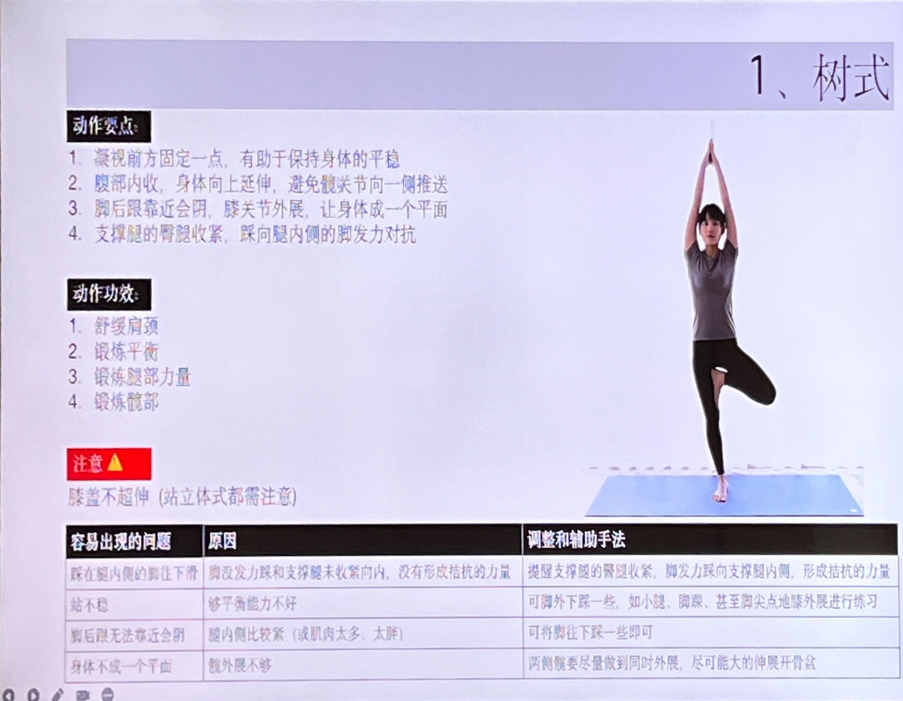

:::

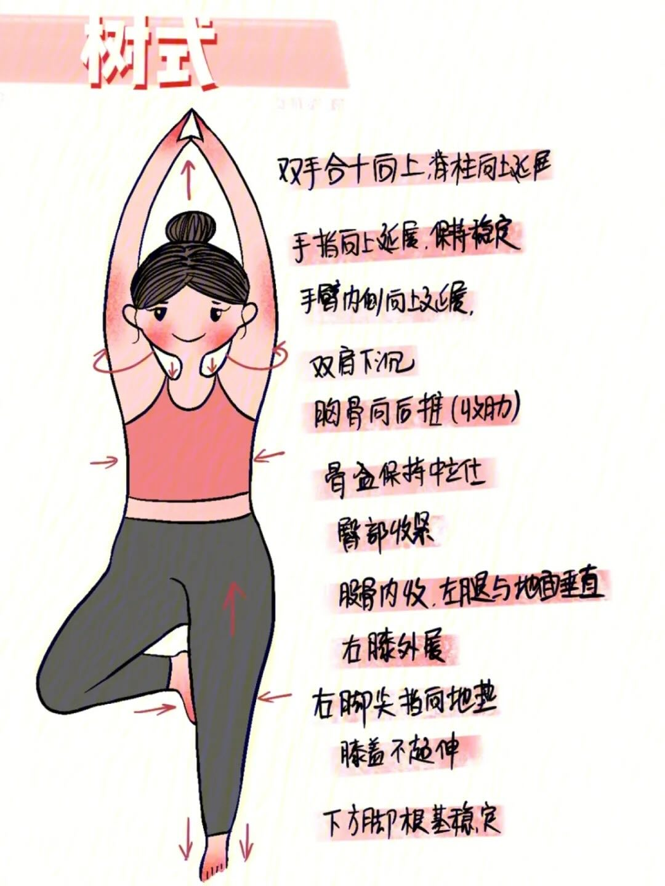

::: danger 注意
1. 高血压，心脏病患者胸前合十，不要上举
2. 膝盖不超伸，不塌腰，不耸肩。
:::

::: warning 动作要点
1. 凝视前方固定一点，有助于保持身体的平稳
2. 腹部内收，身体向上延伸，避免髋关节向一侧推送
3. 脚后跟靠近会阴，膝关节外展，让身体成一个平面
4. 支撑腿的臀腿收紧，踩向腿内侧的脚发力对抗
:::

::: tip 动作功效
1. 消除腿部多余脂肪，美化腿部线条；
2. 习纠正驼背和脊柱不直等不良站姿；
3. 有助于提高身体平衡力，培养专注力，缓解紧张焦虑情绪；
4. 促进各关节血液循环，治疗肩周炎。
:::

::: tip 动作口令
- 正式进入
  1. 舒适的坐姿坐于垫子上站立于垫面上
  2. 重心移至右腿
  3. 手辅助左脚掌平踩于右大腿内侧，脚尖朝下，脚后跟贴靠会阴处
  4. 如果无法保持平衡或脚后跟无法贴靠会阴的话，将左脚掌踩在右膝内侧或右小腿内侧
  5. 吸气，双臂打开向上，双手合掌，拇指轻叩，凝视前方固定一点，帮助保持稳定
  6. 呼气，收腹部，保持右臀腿收紧，左脚发力踩向右腿对抗，以保持脚不往下掉
  7. 保持自然呼吸，注意左膝外展，尽量让整个身体成一个平面
  8. 吸气，解开左脚踩地；呼气，双手还原体侧
:::

::: details 调整和辅助手法
|    容易出现的问题    |                       原因                       |                       调整和辅助手法                       |
| :------------------: | :----------------------------------------------: | :--------------------------------------------------------: |
| 踩在腿内侧的脚往下滑 | 脚没发力踩和支撑腿未收紧向内，没有形成拮抗的力量 | 提醒支撑腿的警腿收紧，脚发力踩向支撑腿内侧，形成拮抗的力量 |
|        站不稳        |                  够平衡能力不好                  |  可脚外下踩一些，如小腿、脚踝、甚至脚尖点地膝外展进行练习  |
|  脚后跟无法靠近会阴  |         腿内侧比较紧（或肌肉太多、太胖）         |                    可将脚往下踩一些即可                    |
|   身体不成一个平面   |                    髋外展不够                    |       两侧髋要尽量做到同时外展，尽可能大的伸展开骨盆       |
:::

## 风吹树式
::: details 课程原图
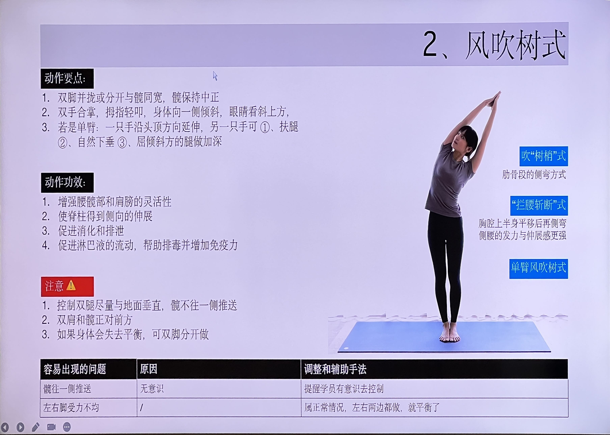
:::

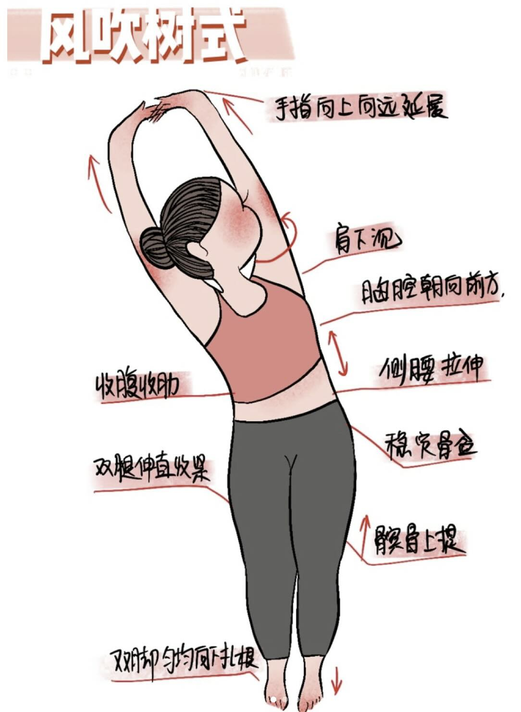

::: danger 注意
1. 控制双腿尽量与地面垂直，髋不往一侧推送
2. 双肩和髋正对前方
3. 如果身体会失去平衡，可双脚分开做
4. 有高血压，心脏病问题者可不抬手练习。
:::

::: warning 动作要点
1. 双脚并拢或分开与髋同宽，髋保持中正
2. 双手合掌，拇指轻叩，身体向一侧倾斜，眼睛看斜上方，
3. 若是单臂：一只手沿头顶方向延伸，另一只手可
​	① 扶腿
​	② 自然下垂
​	③ 屈倾斜方的腿做加深
:::

::: tip 动作功效
1. 减少腹部腰部多余脂肪，扩张胸部，放松肩关节；
2. 改善体态，增强身体的灵活性；
3. 挤压按摩内脏器官，可治疗和预防腰肌劳损，改善脊柱侧弯；
4. 刺激腋下淋巴排毒，改善上背部含胸驼背
:::

::: tip 动作口令
- 正式进入
  1. 山式站立；
  2. 吸气，双手十指相扣，掌心向前，手臂上举过头顶；
  3. 呼气，身体倒向右侧，扭头眼睛看左上方延长线；
  4. 保持5个呼吸；
  5. 吸气身体回正；
  6. 放松，换另一侧
:::

::: details 调整和辅助手法
| 容易出现的问题 |  原因  |           调整和辅助手法           |
| :------------: | :----: | :--------------------------------: |
|  髋往一侧推送  | 无意识 |        提醒学员有意识去控制        |
| 左右脚受力不均 |   /    | 属正常情况，左右两边都做，就平衡了 |
:::

## 战士一式
::: details 课程原图
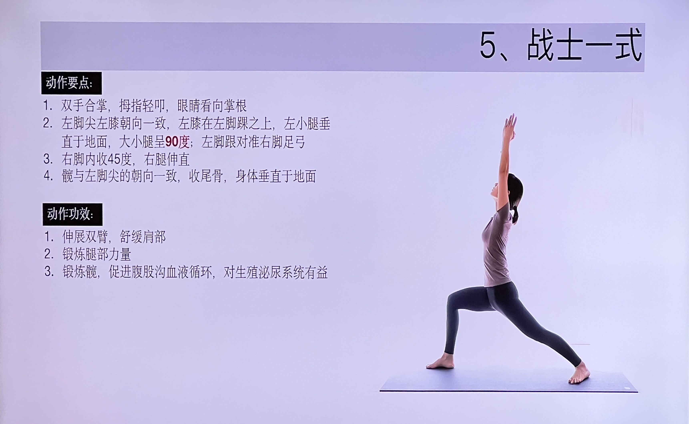
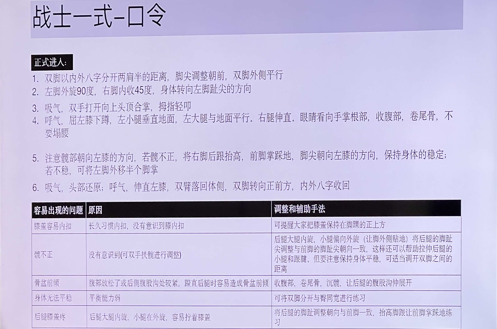
:::
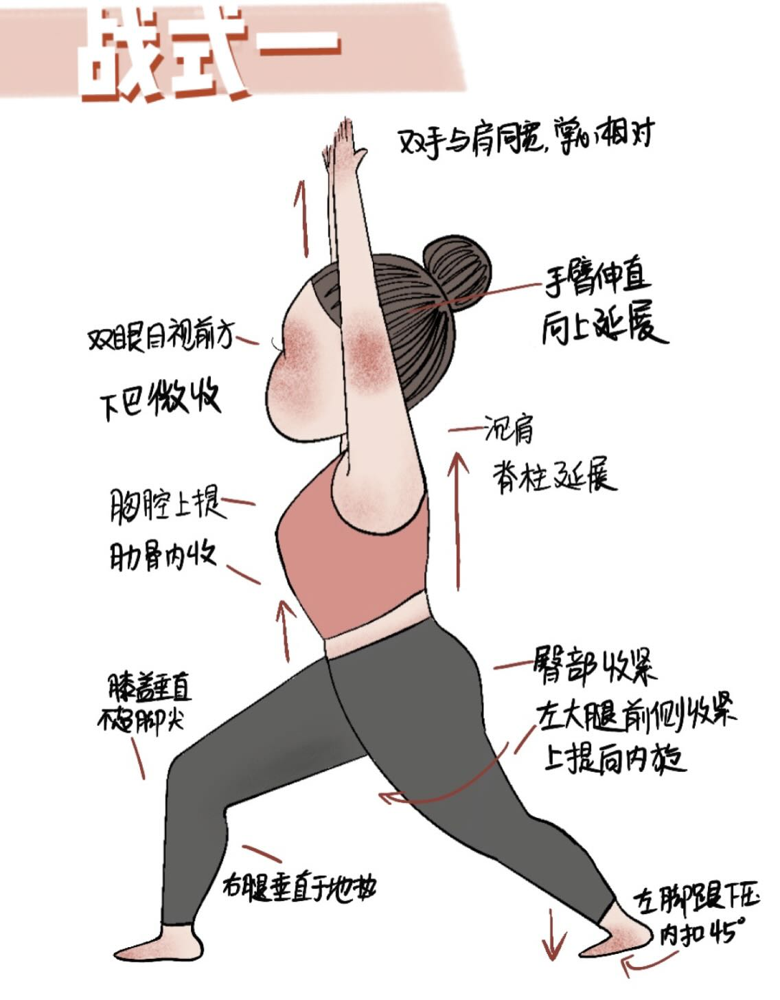
::: danger 注意
1. 心脏病，血压异常的眩晕症患者可以手扶髋，膝盖不超过脚尖，力量不要堆积在腹股沟。
:::
::: warning 动作要点
1. 双手合掌，拇指轻叩，眼睛看向掌根
2. 左脚尖左膝朝向一致，左膝在左脚踝之上，左小腿垂直于地面，大小腿呈90度；左脚跟对准右脚足弓
3. 右脚内收45度，右腿伸直
4. 髋与左脚尖的朝向一致，收尾骨，身体垂直于地面
:::
::: tip 动作功效
1. 伸展双臂，舒缓肩部
2. 锻炼腿部力量
3. 锻炼髋，促进腹股沟血液循环，对生殖泌尿系统有益
:::
::: tip 动作口令
- 正式进入
  1. 双脚以内外八字分开两肩半的距离，脚尖调整朝前，双脚外侧平行
  2. 左脚外旅90度，右脚内收45度，身体转向左脚趾尖的方向
  3. 吸气，双手打开向上头顶合掌，拇指轻叩
  4. 呼气，屈左膝下蹲，左小腿垂直地面，左大腿与地面平行。右腿伸直。眼睛看向手掌根部，收腹部，卷尾骨，不要塌腰
  5. 注意髓部朝向左膝的方向，若髋不正，将右脚后跟抬高，前脚掌踩地，脚尖朝向左膝的方向，保持身体的稳定；若不稳，可将左脚外移半个脚掌
  6. 吸气，头部还原；呼气，伸直左膝，双臂落回体侧，双脚转向正前方，内外八字收回
:::

::: details 调整和辅助手法
|    容易出现的问题    | 原因  |                          调整和辅助手法                          |
| :------------------: | :---: | :--------------------------------------------------------------: |
| 膝盖容易内扣 |   长久习惯内扣，没有意识到膝内扣   | 可提醒大 把膝盖保持在脚踝的正上方 |
| 髋不正 |   没有意识到（可双手扶髋进行调整）   | 后腿大腿内旋，小腿偏向外旋（让脚外侧贴地）将后腿的脚趾尖调整与前脚的脚趾尖朝向一致，这样还可以帮助拉仲后腿的小腿和跟健。但要注意保持身体平稳，可适当调开双脚之间的距离 |
| 骨盆前倾 |   腹部放松了或后侧腹股沟处较紧，蹬直后腿时容易造成骨盆前倾   | 收腹部，卷尾骨，沉髋，让后腿的腹股沟仲展开 |
| 身体无法平稳 |   平衡能力弱   | 可将双脚分开与臀同宽进行练习 |
| 后腿膝盖疼 |   后腿大腿内旋，小腿在外旋，容易拧着膝盖   | 将后腿的脚趾调整朝向与前脚一致，抬高脚跟让前脚掌踩地练习 |
:::

## 战士二式
::: details 课程原图
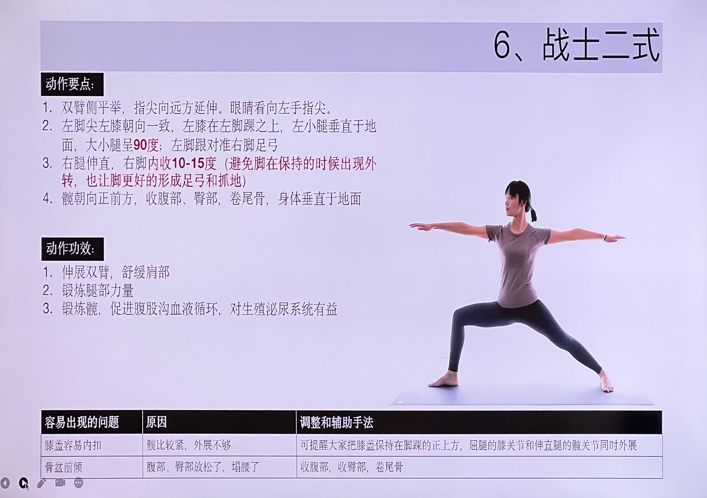
:::
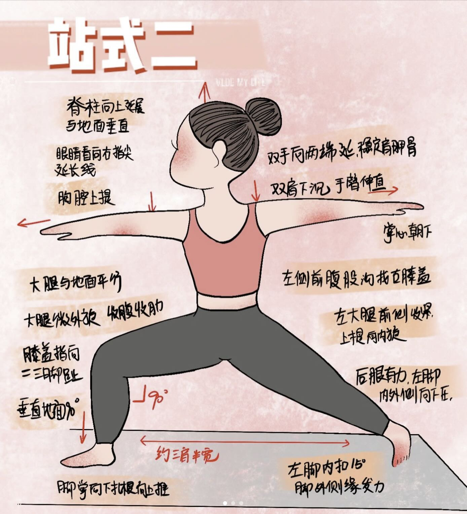
::: danger 注意
1. 心脏病血压异常者和眩晕症患者不宜练习此体式或者双手扶髋不举手。
:::
::: warning 动作要点
1. 双臂侧平举，指尖向远方延伸。眼睛看向左手指尖。
2. 左脚尖左膝朝向一致，左膝在左脚踝之上，左小腿垂直于地面，大小腿呈90度；左脚跟对准右脚足弓
3. 右腿伸直，右脚内收10-15度（避免脚在保持的时候出现外转，也让脚更好的形成足弓和抓地）
4. 髋朝向正前方，收腹部、臀部，卷尾骨，身体垂直于地面
:::
::: tip 动作功效
1. 伸展双臂，舒缓肩部
2. 锻炼腿部力量
3. 锻炼髋，促进腹股沟血液循环，对生殖泌尿系统有益
4. 让腿部线条肌肉匀称、紧致，使双腿线条更优美，减少手臂多余脂肪；
:::
::: tip 动作口令
- 正式进入
  1. 山式站立，双脚分开，双手侧平举，手腕的下方对着脚踝。左脚内扣15度，右脚向右转90度。
  2. 呼气，屈右膝，直到右大腿与地面平行，右小腿与地面垂直；左腿完全伸直，左脚外侧缘发力，扭头向右眼睛看右手指尖延长线。保持5-10个呼吸。
  3. 吸气，伸直右腿，恢复站姿，换另一侧。
:::

::: details 调整和辅助手法
|    容易出现的问题    | 原因  |                          调整和辅助手法                          |
| :------------------: | :---: | :--------------------------------------------------------------: |
| 膝盖容易内扣 |   髋比较紧，外展不够   | 可提醒大象把膝盖保持在脚跌的正上方，屈腿的膝关节和伸直腿的髋关节同时外展 |
| 骨盆前倾 |   腹部、臀部放松了，塌腰了   | 收腹部，收臀部，卷尾骨 |
:::

## 战士三式
::: details 课程原图
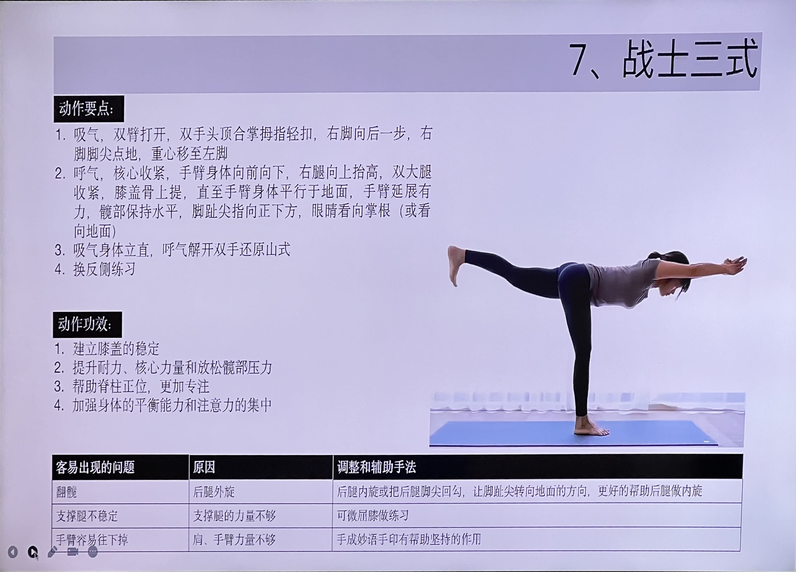
:::

::: danger 注意
1. 心脏病、血压异常者和眩晕症患者不宜练习此体式，脚踝损伤静脉曲张者不练；
2. 避免耸肩，膝盖超伸，避免翻髋。
:::
::: warning 动作要点
1. 吸气，双臂打开，双手头顶合掌拇指轻扣，右脚向后一步，右脚脚尖点地，重心移至左脚
2. 呼气，核心收紧，手臂身体向前向下，右腿向上抬高，双大腿收紧，膝盖骨上提，直至手臂身体平行于地面，手臂延展有力，髋部保持水平，脚趾尖指向正下方，眼睛看向掌根（或看
向地面）
3. 吸气身体立直，呼气解开双手还原山式
4. 换反侧练习
:::
::: tip 动作功效
1. 建立膝盖的稳定
2. 提升耐力、核心力量和放松髋部压力
3. 帮助脊柱正位，更加专注
4. 加强身体的平衡能力和注意力的集中
:::
::: tip 动作口令
- 正式进入
  1. 山式站立，左脚脚尖点地，重心移至右脚，吸气双手由前向上，掌心相对，脊柱向着指尖方向向上延展；
  2. 呼气，折髋，手臂带动身体向前向下，同时抬右腿向后向上，直至手臂、肩背、臀、腿在一条直线上且平行地垫，腹部收紧贴靠脊柱，整个核心向上提，手指之间向前延展绷脚背或者勾脚尖向后延展，保持3-5个呼吸；
  3. 吸气延展脊柱，呼气放下右腿双臂，放松肩背，换反侧练习。
:::

::: details 调整和辅助手法
|    容易出现的问题    | 原因  |                          调整和辅助手法                          |
| :------------------: | :---: | :--------------------------------------------------------------: |
| 翻髋 |   后腿外旋   | 后腿内旋或把后腿购尖回勾，让脚跳尖转问地面的方向，更好的帮助后腿做内旋 |
| 支撑腿不稳定 |   支撑腿的力量不够   | 可微屈膝做练习 |
| 手臂容易往下掉 |   肩、手臂力量不够   | 手成妙语手印有帮助坚持的作用 |
:::

## 猫式
::: details 课程原图
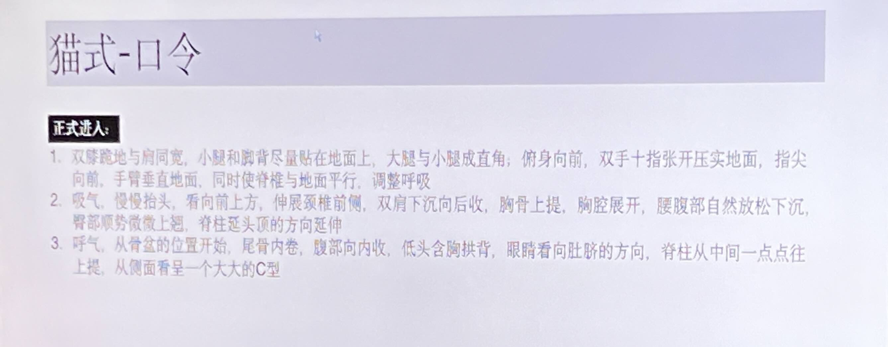
:::

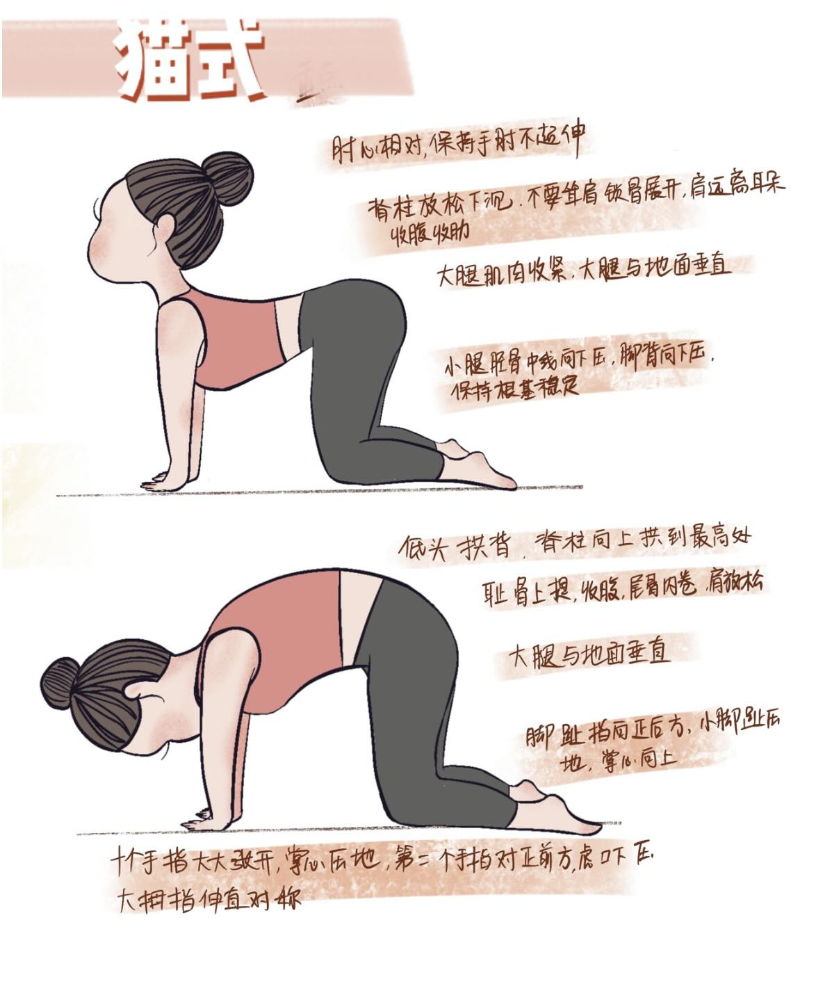

::: warning 动作要点
1. 肘心相对保持手肘不超伸；
2. 脊柱放松下沉，不太耸肩，锁骨展开，肩远离耳朵，收腹收肋；
3. 大腿肌肉收紧，大腿与地面垂直；
4. 小腿胫骨中线向下压，脚背向下压保持根基稳定；
5. 拱背时低头，脊柱拱到最高处；
6. 脚趾指向正后方，小脚趾压地掌心向上；
7. 十指大大张开，掌心压地，第二个手指指向正前方虎口下压，大拇指伸直对称。
:::

::: tip 动作功效
充分伸展背部和肩颈，增加脊柱灵活性，改善背部僵硬，消除酸痛和疲劳，缓解生理期不适，调节内分泌系统，按摩腹部脏器，滋养内脏。
:::

::: tip 动作口令
- 正式进入
  1. 四角板凳式进入，双膝与髋同宽，手放肩的正下方；
  2. 吸气，抬头塌腰，脊柱一节一节放松下沉，尾骨上翘，胸腔上提，锁骨展开，肩远离耳朵，眼睛看正上方延长线；
  3. 呼气，低头拱背向上推，耻骨上提，尾骨内卷，双手向下扎根，收腹收肋，肩放松；
  4. 配合呼吸反复6次。
:::

## 幻椅式
::: details 课程原图
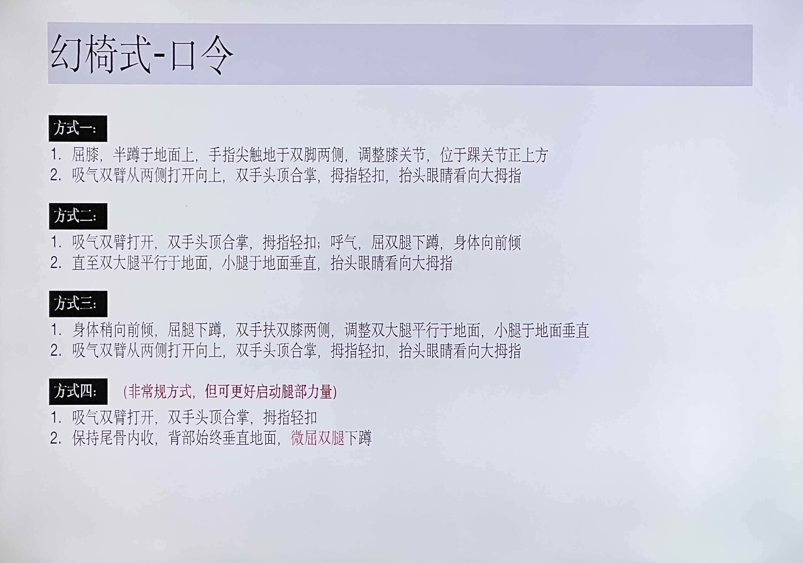
:::

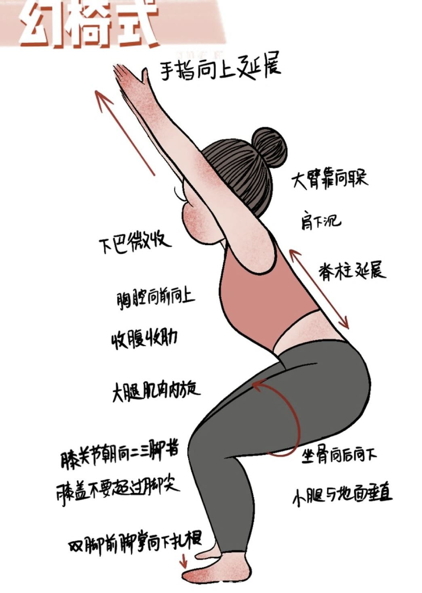

::: danger 注意
1. 高血压或肩颈僵硬者互抱手肘；
2. 膝盖不超过脚尖。
:::

::: warning 动作要点
1. 手指向上延展
:::

::: tip 动作功效
1. 拉伸身体线条，灵活膝关节，修正腿形矫正不良体态；
2. 有助于减少腿部和腰部脂肪，伸展背部肌肉群，缓解肩部疲劳和僵硬，缓解背部疼痛。
:::

::: tip 动作口令
- 正式进入
  1. 山式站立，双脚分开与髋同宽；
  2. 吸气 双手由前向上举过头顶；
  3. 呼气 屈膝曲髋臀部向后坐，前脚掌向下扎根，膝关节朝向二三脚趾，膝盖不要超过脚趾尖；目视前方，保持5个呼吸；
  4. 吸气，吸气腿伸直；
  5. 呼气双手由前向下回到山式站立。
:::

## 三角伸展式
::: details 课程原图
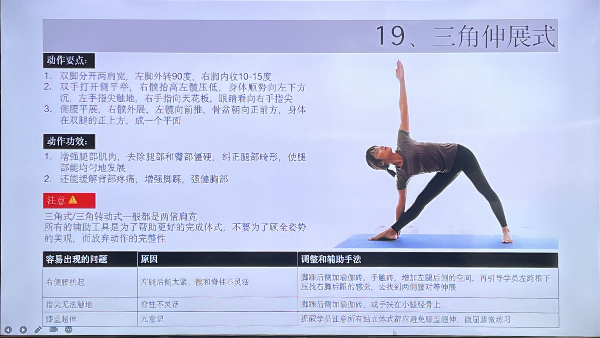
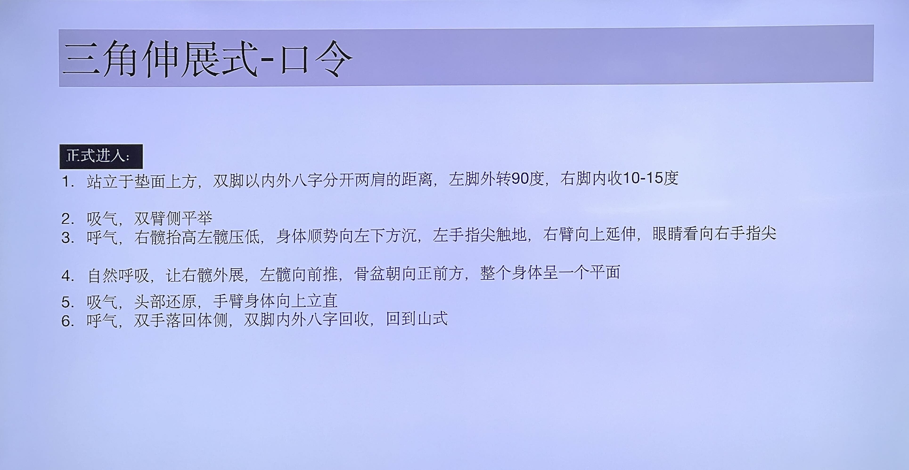
:::

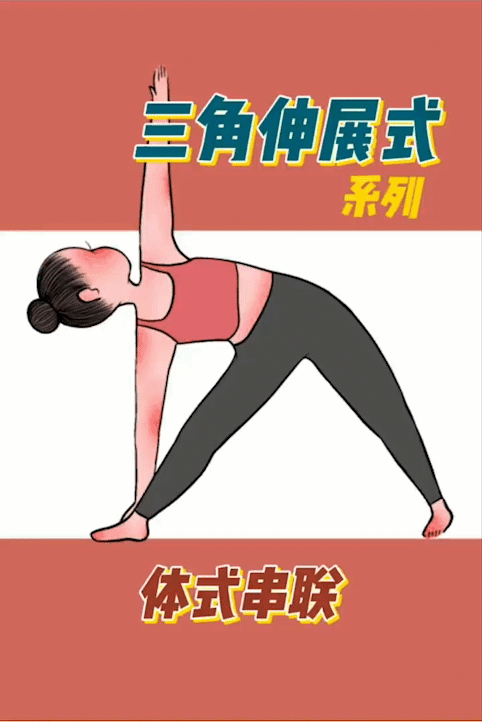

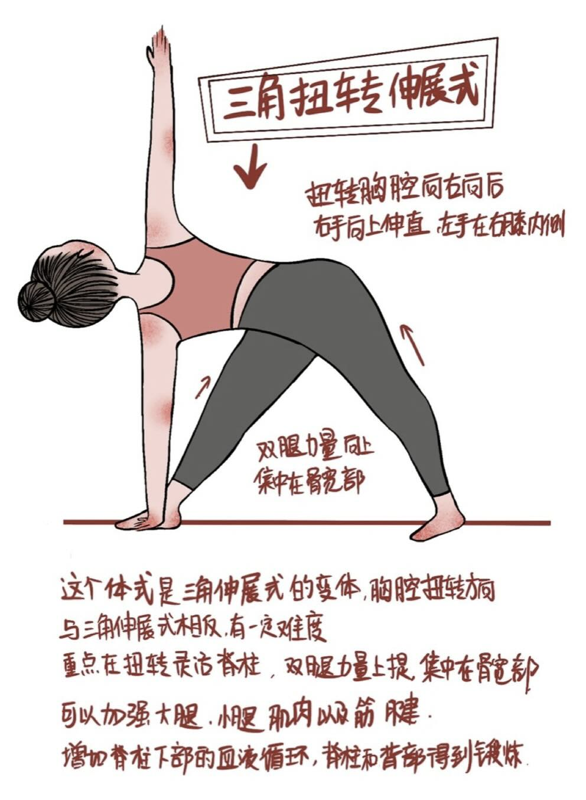

::: danger 注意
1. 三角式/三角转动式一般都是两倍肩宽
2. 所有的辅助工具是为了帮助更好的完成体式，不要为了顾全姿势的美观，而放弃动作的
3. 脊椎损伤者务必在有经验的瑜伽老师指导下进行练习；
低血压、头痛、腹泻和失眠者请勿练习此体式；
4. 颈椎不好的练习者，可以在保持姿势时脸部朝下，放松颈椎；
5. 怀孕6个月之后不再练习此体式；
6. 脚踝有伤，可减小距离或微屈膝，下腰背疼痛可减小侧弯幅度;
:::

::: warning 动作要点
1. 双脚分开两肩宽，左脚外转90度，右脚内收10-15度
2. 双手打开侧平举，右髋抬高左髋压低，身体顺势向左下方右手指向天花板，
3. 侧腰平展，右磅外展，左髋向前推，骨盆朝向正前方，身体在双腿的正上方，成一个平面
:::

::: tip 动作功效
1. 增强腿部肌肉，去除腿部和臀部僵硬，纠正腿部畸形，使腿部能均匀地发展
2. 还能缓解背部疼痛，增强脚踝，强健胸部
3. 消除侧腰的赘肉，使腰部更纤细，拉伸腿部和腰部韧带，使身体线条更优美。
4. 对颈部及肩关节的疼痛，颈椎僵硬者有治疗作用，使脊椎骨骼柔韧，提高精力集中的能力。
5. 调整X型腿，调整脊柱侧弯和坐骨神经痛。
:::

::: tip 动作口令
- 正式进入
  1. 山式站立，双脚分开，双手侧平举，手腕下方对脚踝，左脚内扣60度，右脚右转90度；
  2. 吸气，右手向右延展；
  3. 呼气，右手向右落右脚外侧，扭头眼睛向上看左手指尖方向。保持5个呼吸。
  4. 吸气，左手拉动身体回正，换另一侧。
:::

::: details 调整和辅助手法
| 容易出现的问题 |             原因             |                                              调整和辅助手法                                              |
| :------------: | :--------------------------: | :------------------------------------------------------------------------------------------------------: |
|   右侧腰拱起   | 左腿后侧太紧、髋和脊柱不灵活 | 脚踝后侧加瑜伽砖，手触砖，增加左腿后侧的空间，再引导学员左跨根下压找右脚后跟的感觉，去找到两侧腰对等伸展 |
|  指尖无法触地  |          脊柱不灵活          |                                   脚踝后侧加瑜伽砖，或手扶在小腿胫骨上                                   |
|  指尖无法触地  |
|    膝盖超伸    |            无意识            |                          提醒学员注意所有站立体式都应避免膝盖超伸，微屈膝做练习                          |
:::

## 侧角伸展式
::: details 课程原图
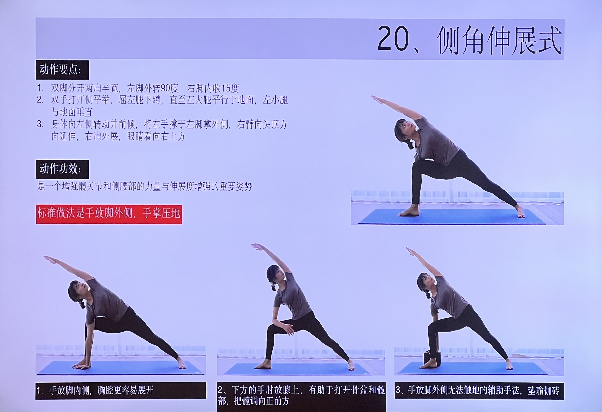
:::

::: danger 注意
1. 左脚内侧向下压，左大腿收紧上提；
2. 右膝外侧与右手肘内侧对抗，帮助打开胸腔；
3. 肩颈不适者眼睛向前看
:::

::: warning 动作要点
1. 双脚分开两肩半宽，左脚外转90度，右脚内收15度
2. 双手打开侧平举，屈左腿下蹲，直至左大腿平行于地面，左小腿与地面垂直
3. 身体向左侧转动并前倾，将左手撑于左脚掌外侧，右臂向头顶方向延伸，右肩外展，眼晴看向右上方
:::

::: tip 动作功效
1. 是一个增强髋关节和侧腰部的力量与伸展度增强的重要姿势
2. 扩展胸腔，减轻关节酸痛，刺激肠胃系统蠕动，有助于消化；
3. 加强脚踝，膝盖和大腿稳定性，帮助关节归位；
4. 改善不良体态和圆肩驼背，灵活腕关节。
:::

::: tip 动作口令
- 正式进入
  1. 战式二进入；
  2. 吸气，延展脊柱；
  3. 呼气，右手向下放在右脚外侧。右膝外侧与右手肘内侧对抗，左臂贴耳，指尖有力向前向上延展。保持5个呼吸；
  4. 吸气，左手旋肩向后，收右手穿过右大腿内侧与左手互扣。
  5. 呼气，脊柱向头顶延展，左肩向后旋，左脚内侧向下压。
:::

## 鸵鸟式
::: details 课程原图
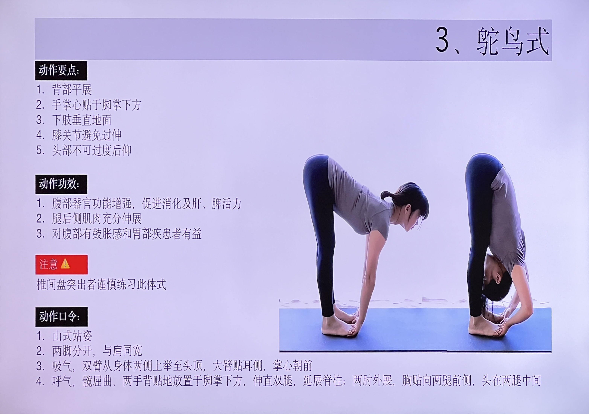
:::

::: danger 注意
椎间盘突出者谨慎练习此体式
:::

::: warning 动作要点
1. 背部平展
2. 手掌心贴于脚掌下方
3. 下肢垂直地面
4. 膝关节避免过伸
5. 头部不可过度后仰
:::

::: tip 动作功效
1. 腹部器官功能增强，促进消化及肝、脾活力
2. 腿后侧肌肉充分伸展
3. 对腹部有鼓胀感和胃部疾患者有益
:::

::: tip 动作口令
- 正式进入
  1. 山式站姿
  2. 两脚分开，与肩同宽
  3. 吸气，双臂从身体两侧上举至头顶，大臂贴耳侧，掌心朝前
  4. 呼气，髋屈曲，两手背贴地放置于脚掌下方，伸直双腿，延展脊柱；两肘外展，胸贴向两腿前侧，头在两腿中间
:::

## 山式坐姿
::: details 课程原图
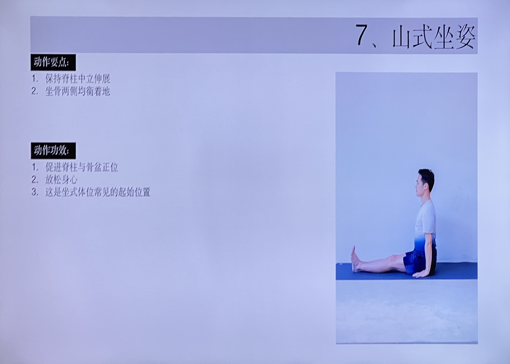
:::

::: warning 动作要点
1. 保持脊柱中立伸展
2. 坐骨两侧均衡着地
:::

::: tip 动作功效
1. 促进脊柱与骨盆正位
2. 放松身心
3. 这是坐式体位常见的起始位置
:::

## 仰卧单腿锁腿
::: details 课程原图
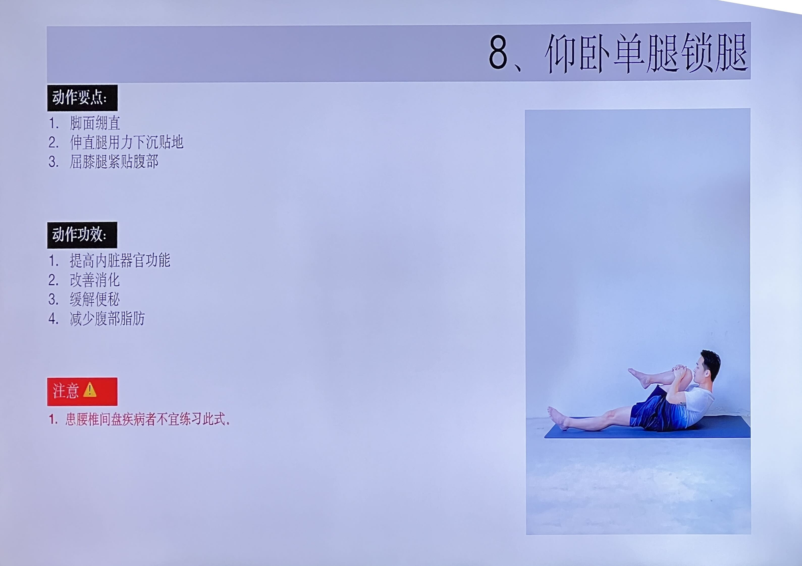
:::

::: danger 注意
1. 患腰椎间盘疾病者不宜练习此式。
:::

::: warning 动作要点
1. 脚面绷直
2. 伸直腿用力下沉贴地
3. 屈膝腿紧贴腹部
:::

::: tip 动作功效
1. 提高内脏器官功能
2. 改善消化
3. 缓解便秘
4. 减少腹部脂肪
:::

## 仰卧双腿锁腿
::: details 课程原图
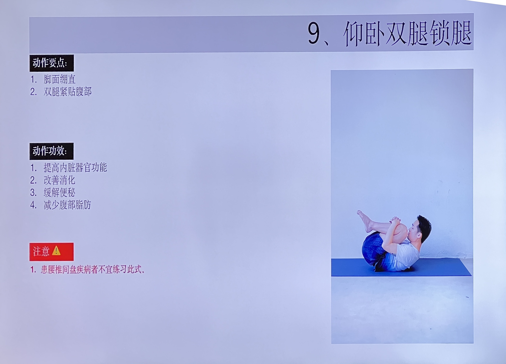
:::
::: danger 注意
1. 患腰椎间盘疾病者不宜练习此式。
:::

::: warning 动作要点
1. 脚面绷直
2. 双腿紧贴腹部
:::
::: tip 动作功效
1. 提高内脏器官功能
2. 改善消化
3. 缓解便秘
4. 减少腹部脂肪
:::

## 桌子
::: details 课程原图
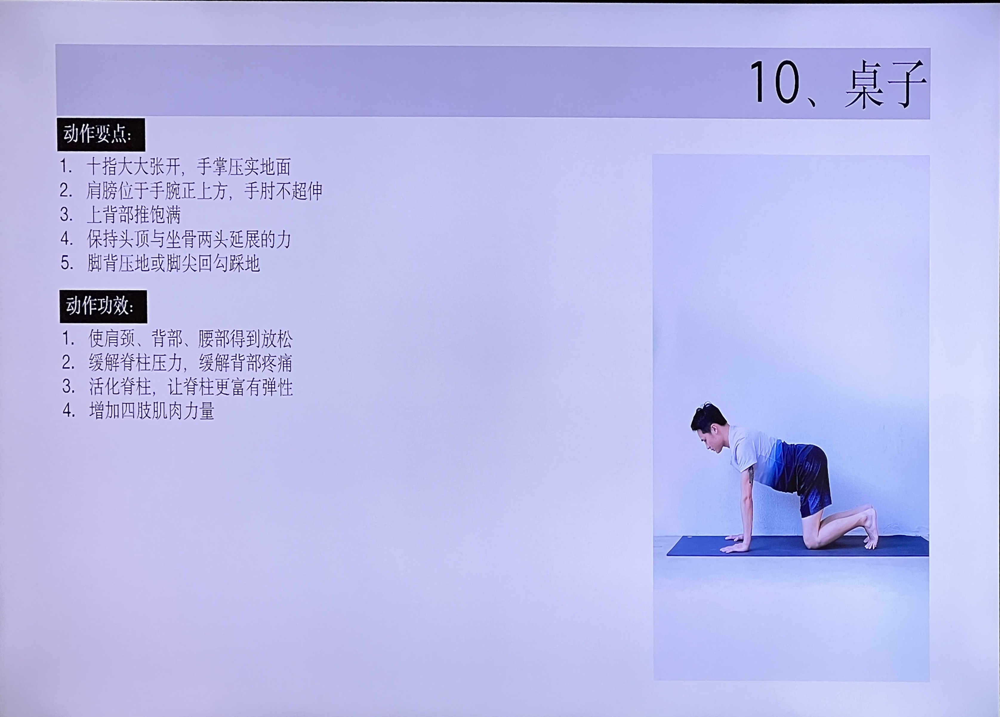
:::
::: warning 动作要点
1. 十指大大张开，手掌压实地面
2. 肩膀位于手腕正上方，手肘不超伸
3. 上背部推饱满
4. 保持头顶与坐骨两头延展的力
5. 脚背压地或脚尖回勾踩地
:::
::: tip 动作功效
1. 使肩颈、背部、腰部得到放松
2. 缓解脊柱压力，缓解背部疼痛
3. 活化脊柱，让脊柱更富有弹性
4. 增加四肢肌肉力量
:::

## 简易鸽式
::: details 课程原图
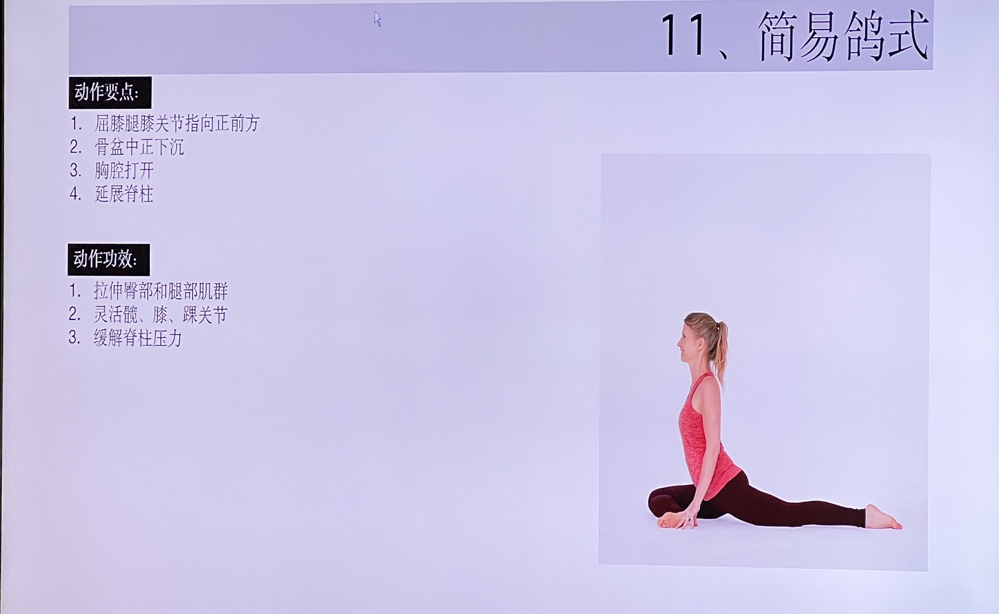
:::
::: warning 动作要点
1. 屈膝腿膝关节指向正前方
2. 骨盆中正下沉
3. 胸腔打开
4. 延展脊柱
:::
::: tip 动作功效
1. 拉伸臀部和腿部肌群
2. 灵活髋、膝、踝关节
3. 缓解脊柱压力
:::

## 花环式
::: details 课程原图
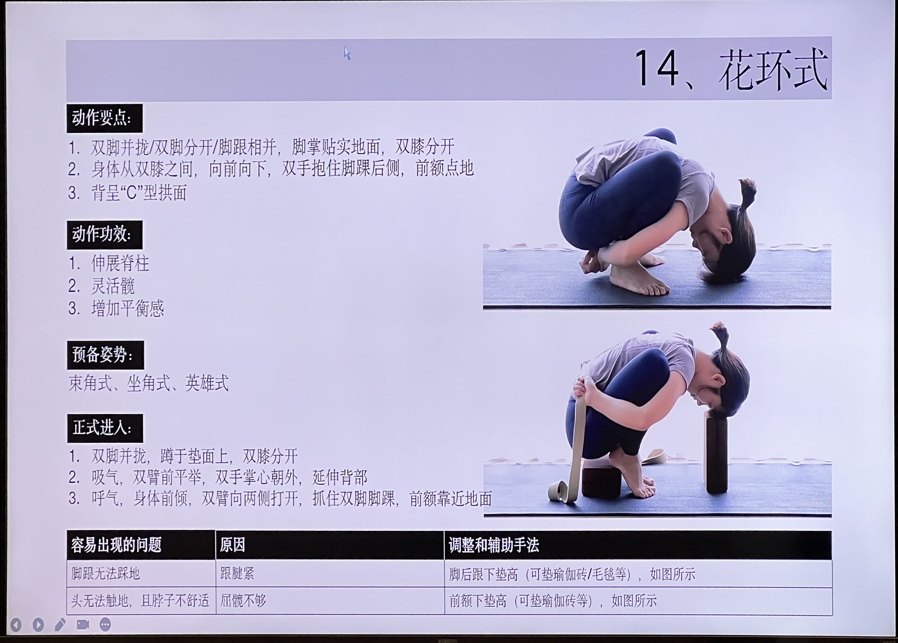
:::
::: warning 动作要点
1. 双脚并拢/双脚分开/脚跟相并，脚掌贴实地面，双膝分开
2. 身体从双膝之间，向前向下，双手抱住脚踝后侧，前额点地
3. 背星“C”型拱面
:::
::: tip 动作功效
1. 伸展脊柱
2. 灵活髋
3. 增加平衡感
:::

::: tip 动作口令
- 预备姿势
  1. 束角式、坐角式、英雄式
- 正式进人
  1. 双脚并拢，蹲于垫面上，双膝分开
  2. 吸气，双臂前平举，双手掌心朝外，延伸背部
  3. 呼气，身体前倾，双臂向两侧打开，抓住双脚脚踝，前额靠近地面
:::

::: details 调整和辅助手法
|      容易出现的问题      |   原因   |               调整和辅助手法                |
| :----------------------: | :------: | :-----------------------------------------: |
|       脚跟无法踩地       |  跟腱紧  | 脚后跟下垫高（可垫瑜伽砖/毛毯等），如图所示 |
| 头无法触地，且脖子不舒适 | 屈髋不够 |    前额下垫高（可垫瑜伽砖等），如图所示     |
:::

## 大拜（主动婴儿）式
::: details 课程原图
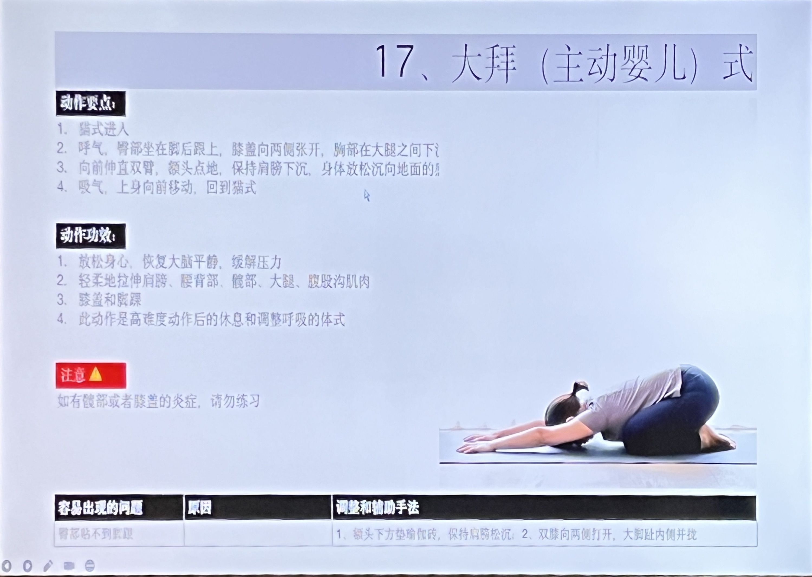
:::

::: danger 注意
1. 如有髋部或者膝盖的炎症，请勿练习
:::
::: warning 动作要点
1. 猫式进入
2. 呼气，腎部坐在脚后跟上，膝盖向两侧张开，胸部在大腿之间下？
3. 向前伸直观臂，额头点地，保持肩下沉，身体放松沉向地面的身
4. 吸气，上身向的移动，回到猫式
:::
::: tip 动作功效
1. 放松身心，侠复大 平静，缓解压力
2. 轻柔地拉伸肩膀、腰背部、镜部、大腿、腹股沟肌肉
3. 膝盖和脚踝
4. 此动作是高难度动作后的休息和调整呼吸的体式
:::

::: details 调整和辅助手法
| 容易出现的问题 | 原因  |                            调整和辅助手法                            |
| :------------: | :---: | :------------------------------------------------------------------: |
| 臀部貼不到緊題 |   /   | 1、额头下力垫瑜伽砖，保特肩膀松沉：2、双膝向两侧打开，大脚趾内侧并找 |
:::

## 敬礼式
::: details 课程原图
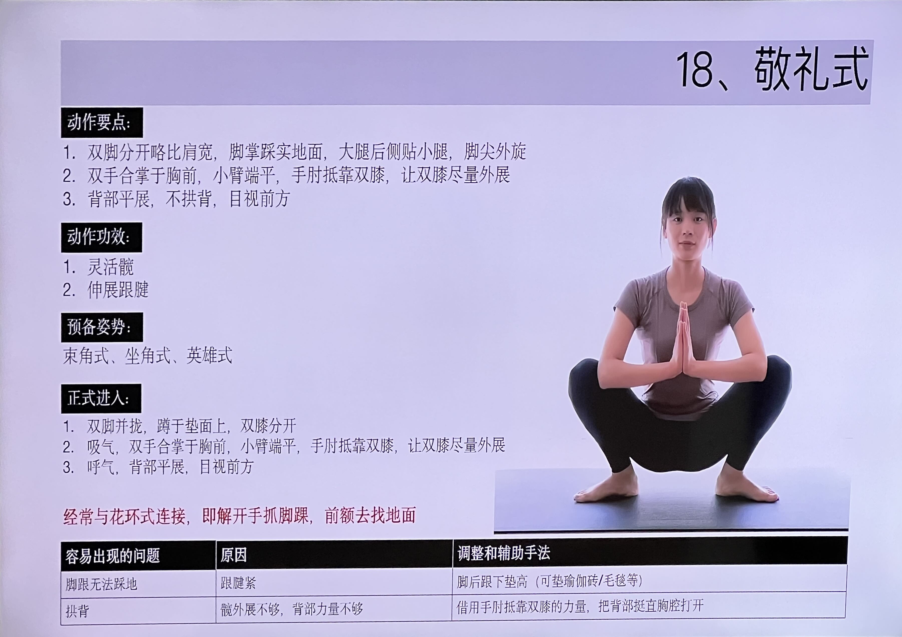
:::

::: danger 注意
1. 经常与花环式连接，即解开手抓脚踝，前额去找地面
:::
::: warning 动作要点
1. 双脚分开略比肩宽，脚掌踩实地面，大腿后侧贴小腿，脚尖外旋
2. 双手合掌于胸前，小臂端平，手肘抵靠双膝，让双膝尽量外展
3. 背部平展，不拱背，目视前方
:::
::: tip 动作功效
1. 灵活髋
2. 伸展跟腱
:::

::: tip 动作口令
- 预备姿势
  1. 束角式、坐角式、英雄式
- 正式进人
  1. 双脚并拢，蹲于垫面上，双膝分开
  2. 吸气，双手合掌于胸前，小臂端平，手肘抵靠双膝，让双膝尽量外展
  3. 呼气，背部平展，目视前方
:::

::: details 调整和辅助手法
| 容易出现的问题 |           原因           |                调整和辅助手法                |
| :------------: | :----------------------: | :------------------------------------------: |
|  脚跟无法踩地  |          跟腱紧          |      脚后跟下垫高（可垫瑜伽砖/毛毯等）       |
|      拱背      | 髋外展不够，背部力量不够 | 借用手肘抵靠双膝的力量，把背部挺直胸腔打开） |
:::

## 例角伸展式
::: details 课程原图

:::

::: danger 注意
1. 标准做法是手放脚外侧，手掌压地
:::

::: warning 动作要点
1. 双脚分开两肩半宽，左脚外转90度，右脚内收15度
2. 双手打开侧平举，屈左腿下蹲，直至左大腿平行于地面，左小腿与地面垂直
3. 身体向左侧转动并前倾，将左手撑于左脚掌外侧，右臂向头顶方向延伸，右肩外展，眼晴看向右上方
:::
::: tip 动作功效
是一个增强髋关节和侧腰部的力量与伸展度增强的重要姿势
:::

## 站立腰躯扭转式
::: details 课程原图
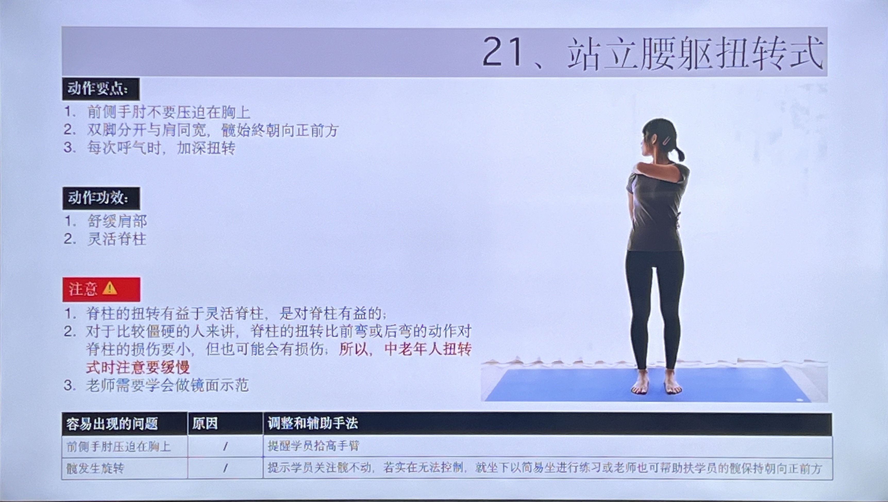
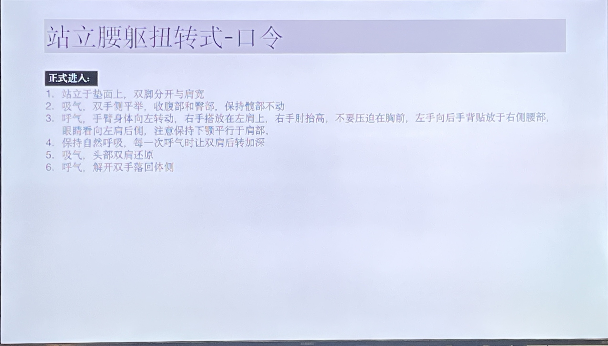
:::

::: danger 注意
1. 脊柱的扭转有益于灵活脊柱，是对脊柱有益的；
2. 对于比较僵硬的人来讲，脊柱的扭转比前弯或后弯的动作对脊柱的损伤要小，但也可能会有损伤；所以，中老年人扭转式时注意要缓慢
3. 老师需要学会做镜面示范
:::
::: warning 动作要点
1. 前侧手肘不要压迫在胸上
2.双脚分开与肩同宽，髋始終朝向正前方
3.每次呼气时，加深扭转
:::
::: tip 动作功效：
1. 舒缓肩部
2. 灵活脊柱
:::

::: tip 动作口令
- 正式进入
1. 站立于垫面上，双脚分开与肩宽
2. 吸气，双手侧平举，收腹部和臀部，保持髋部不动
3. 呼气，手臂身体向左转动，右手搭放在左肩上，右手射抬高，不要压迫在胸前，左手向后手背贴放于右侧腰部，眼睛看向左肩后侧，注意保持下颚平行于肩部。
4. 保持自然呼吸，每一次呼气时让双肩后转加深
5. 吸气，头部双肩还原
6. 呼气，解开双手落回体侧
:::

::: details 调整和辅助手法
|  容易出现的问题  | 原因  |                                         调整和辅助手法                                         |
| :--------------: | :---: | :--------------------------------------------------------------------------------------------: |
| 前侧手肘压迫胸上 |   /   |                                        提醒学员拾高手臂                                        |
|    髋发生旋转    |   /   | 提示学员关注髋不动，若实在无法控制，就坐下以简易坐进行练习或老师也可帮助扶学员的髋保持向正前方 |
:::

## 坐姿侧展式
::: details 课程原图
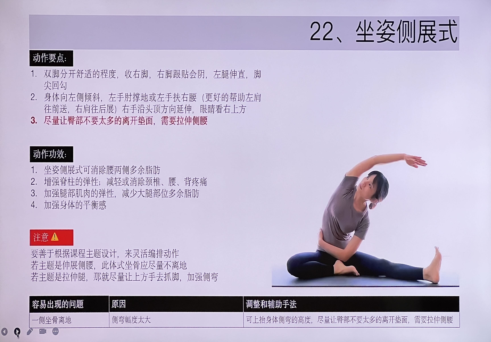
:::
::: danger 注意
1. 要善于根据课程主题设计，来灵活编排动作
2. 若主题是伸展侧腰，此体式坐骨应尽量不离地若主题是拉伸腿，那就尽量让上方手去抓脚，加强侧弯
:::
::: warning 动作要点
1. 双脚分开舒适的程度，收右脚，右脚跟贴会阴，左腿伸直，脚尖回勾
2. 身体向左侧倾斜，左手肘撑地或左手扶右腰（更好的帮助左肩往前送，右肩往后展）右手沿头顶方向延伸，眼睛看右上方
3.尽量让臀部不要太多的离开垫面，需要拉伸侧腰
:::
::: tip 动作功效
1.坐姿侧展式可消除腰两侧多余脂防
2. 增强脊柱的弹性；减轻或消除颈椎、腰、背疼痛
3. 加强腿部肌肉的弹性，減少大腿部位多余脂防
4. 加强身体的平衡感
:::

::: details 调整和辅助手法
| 容易出现的问题 |     原因     |                          调整和辅助手法                          |
| :------------: | :----------: | :--------------------------------------------------------------: |
|  一侧坐骨离地  | 侧弯幅度太大 | 可上抬身体侧弯的高度，尽量让臀部不要太多的离开垫面，需贾拉件侧腰 |
:::

## 摇摆
::: details 课程原图
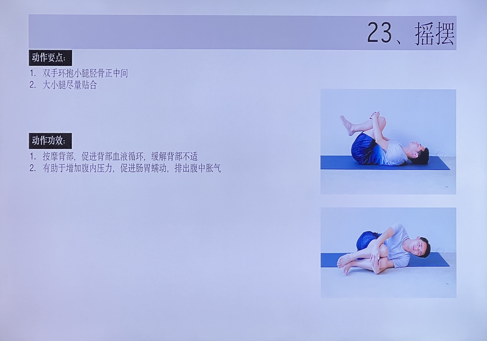
:::

::: warning 动作要点
1. 双手环抱小腿胫骨正中间
2. 大小腿尽量贴合
:::
::: tip 动作功效
1. 按摩背部，促进背部血液循环，缓解背部不适
2. 有助于增加腹内压力，促进肠胃蠕动，排出腹中胀气
:::

## 仰卧扭脊式
::: details 课程原图
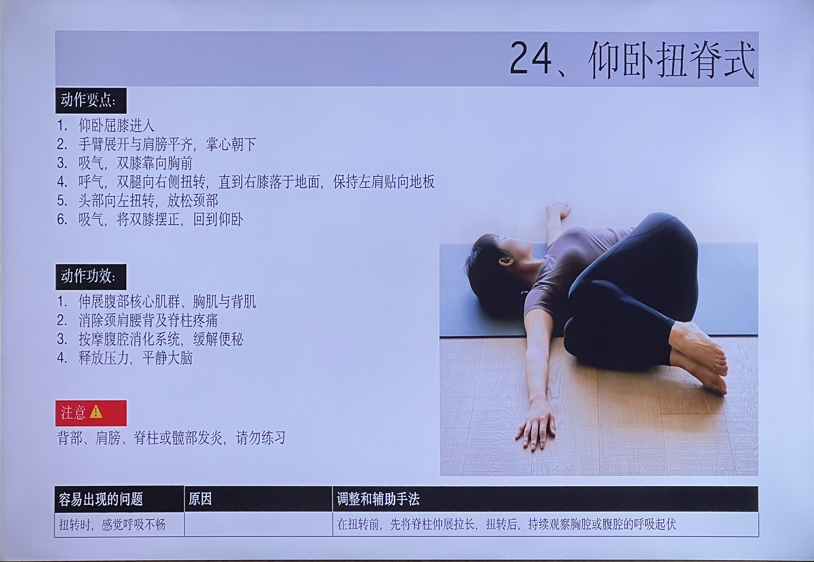
:::
::: danger 注意
1. 背部、肩膀、脊柱或髋部发炎，请勿练习
:::
::: warning 动作要点
1. 仰卧屈膝进入
2. 手臂展开与肩膀平齐，掌心朝下
3. 吸气，双膝靠向胸前
4. 呼气，双腿向右侧扭转，直到右膝落于地面，保持左肩贴向地板
5. 头部向左扭转，放松颈部
6. 吸气，将双膝摆正，回到仰卧
:::
::: tip 动作功效
1. 伸展腹部核心肌群、胸肌与背肌
2. 消除颈肩腰背及脊柱疼痛
3. 按摩腹腔消化系统，缓解便秘
4. 释放压力，平静大脑
:::

::: details 调整和辅助手法
|    容易出现的问题    | 原因  |                          调整和辅助手法                          |
| :------------------: | :---: | :--------------------------------------------------------------: |
| 扭转时，感觉呼吸不畅 |   /   | 在扭转前，先将脊柱仲展拉长，扭转后，持续观察胸腔或腹腔的呼吸起伏 |
:::
