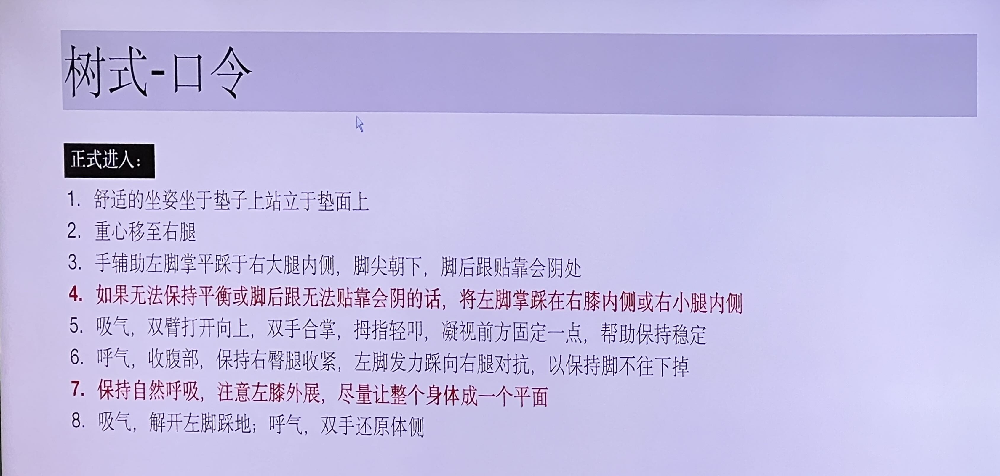
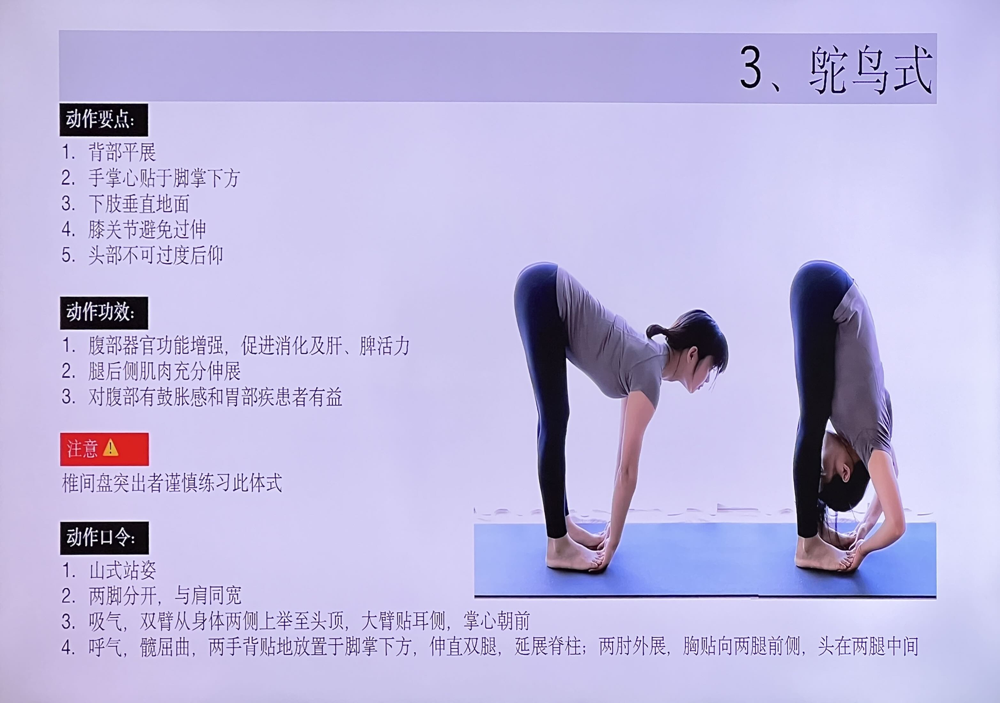
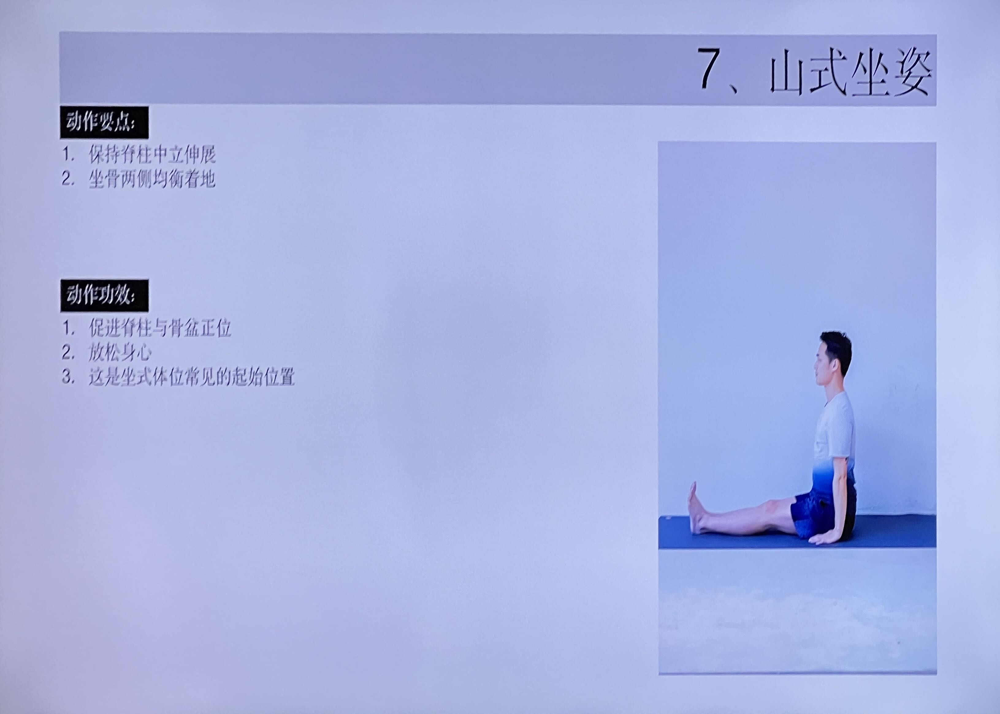

# 动作课程笔记

## 树式
::: details 课程原图

:::

::: danger 注意
1. 高血压，心脏病患者胸前合十，不要上举
2. 膝盖不超伸，不塌腰，不耸肩。
:::

::: warning 动作要点
1. 凝视前方固定一点，有助于保持身体的平稳
2. 腹部内收，身体向上延伸，避免髋关节向一侧推送
3. 脚后跟靠近会阴，膝关节外展，让身体成一个平面
4. 支撑腿的臀腿收紧，踩向腿内侧的脚发力对抗
:::

::: tip 动作功效
1. 消除腿部多余脂肪，美化腿部线条；
2. 习纠正驼背和脊柱不直等不良站姿；
3. 有助于提高身体平衡力，培养专注力，缓解紧张焦虑情绪；
4. 促进各关节血液循环，治疗肩周炎。
:::

::: tip 动作口令
- 正式进入
  1. 舒适的坐姿坐于垫子上站立于垫面上
  2. 重心移至右腿
  3. 手辅助左脚掌平踩于右大腿内侧，脚尖朝下，脚后跟贴靠会阴处
  4. 如果无法保持平衡或脚后跟无法贴靠会阴的话，将左脚掌踩在右膝内侧或右小腿内侧
  5. 吸气，双臂打开向上，双手合掌，拇指轻叩，凝视前方固定一点，帮助保持稳定
  6. 呼气，收腹部，保持右臀腿收紧，左脚发力踩向右腿对抗，以保持脚不往下掉
  7. 保持自然呼吸，注意左膝外展，尽量让整个身体成一个平面
  8. 吸气，解开左脚踩地；呼气，双手还原体侧
:::

::: details 调整和辅助手法
|    容易出现的问题    |                       原因                       |                       调整和辅助手法                       |
| :------------------: | :----------------------------------------------: | :--------------------------------------------------------: |
| 踩在腿内侧的脚往下滑 | 脚没发力踩和支撑腿未收紧向内，没有形成拮抗的力量 | 提醒支撑腿的警腿收紧，脚发力踩向支撑腿内侧，形成拮抗的力量 |
|        站不稳        |                  够平衡能力不好                  |  可脚外下踩一些，如小腿、脚踝、甚至脚尖点地膝外展进行练习  |
|  脚后跟无法靠近会阴  |         腿内侧比较紧（或肌肉太多、太胖）         |                    可将脚往下踩一些即可                    |
|   身体不成一个平面   |                    髋外展不够                    |       两侧髋要尽量做到同时外展，尽可能大的伸展开骨盆       |
:::

## 风吹树式
::: details 课程原图

:::

::: danger 注意
1. 控制双腿尽量与地面垂直，髋不往一侧推送
2. 双肩和髋正对前方
3. 如果身体会失去平衡，可双脚分开做
4. 有高血压，心脏病问题者可不抬手练习。
:::

::: warning 动作要点
1. 双脚并拢或分开与髋同宽，髋保持中正
2. 双手合掌，拇指轻叩，身体向一侧倾斜，眼睛看斜上方，
3. 若是单臂：一只手沿头顶方向延伸，另一只手可
​	① 扶腿
​	② 自然下垂
​	③ 屈倾斜方的腿做加深
:::

::: tip 动作功效
1. 减少腹部腰部多余脂肪，扩张胸部，放松肩关节；
2. 改善体态，增强身体的灵活性；
3. 挤压按摩内脏器官，可治疗和预防腰肌劳损，改善脊柱侧弯；
4. 刺激腋下淋巴排毒，改善上背部含胸驼背
:::

::: tip 动作口令
- 正式进入
  1. 山式站立；
  2. 吸气，双手十指相扣，掌心向前，手臂上举过头顶；
  3. 呼气，身体倒向右侧，扭头眼睛看左上方延长线；
  4. 保持5个呼吸；
  5. 吸气身体回正；
  6. 放松，换另一侧
:::

::: details 调整和辅助手法
| 容易出现的问题 |  原因  |           调整和辅助手法           |
| :------------: | :----: | :--------------------------------: |
|  髋往一侧推送  | 无意识 |        提醒学员有意识去控制        |
| 左右脚受力不均 |   /    | 属正常情况，左右两边都做，就平衡了 |
:::

## 鸵鸟式
::: details 课程原图

:::

::: danger 注意
椎间盘突出者谨慎练习此体式
:::

::: warning 动作要点
1. 背部平展
2. 手掌心贴于脚掌下方
3. 下肢垂直地面
4. 膝关节避免过伸
5. 头部不可过度后仰
:::

::: tip 动作功效
1. 腹部器官功能增强，促进消化及肝、脾活力
2. 腿后侧肌肉充分伸展
3. 对腹部有鼓胀感和胃部疾患者有益
:::

::: tip 动作口令
- 正式进入
  1. 山式站姿
  2. 两脚分开，与肩同宽
  3. 吸气，双臂从身体两侧上举至头顶，大臂贴耳侧，掌心朝前
  4. 呼气，髋屈曲，两手背贴地放置于脚掌下方，伸直双腿，延展脊柱；两肘外展，胸贴向两腿前侧，头在两腿中间
:::

## 山式坐姿
::: details 课程原图

:::

::: warning 动作要点
1. 保持脊柱中立伸展
2. 坐骨两侧均衡着地
:::

::: tip 动作功效
1. 促进脊柱与骨盆正位
2. 放松身心
3. 这是坐式体位常见的起始位置
:::

## 三角伸展式
::: details 课程原图

:::

::: danger 注意
1. 三角式/三角转动式一般都是两倍肩宽
2. 所有的辅助工具是为了帮助更好的完成体式，不要为了顾全姿势的美观，而放弃动作的
3. 脊椎损伤者务必在有经验的瑜伽老师指导下进行练习；
低血压、头痛、腹泻和失眠者请勿练习此体式；
4. 颈椎不好的练习者，可以在保持姿势时脸部朝下，放松颈椎；
5. 怀孕6个月之后不再练习此体式；
6. 脚踝有伤，可减小距离或微屈膝，下腰背疼痛可减小侧弯幅度;
:::

::: warning 动作要点
1. 双脚分开两肩宽，左脚外转90度，右脚内收10-15度
2. 双手打开侧平举，右髋抬高左髋压低，身体顺势向左下方右手指向天花板，
3. 侧腰平展，右磅外展，左髋向前推，骨盆朝向正前方，身体在双腿的正上方，成一个平面
:::

::: tip 动作功效
1. 增强腿部肌肉，去除腿部和臀部僵硬，纠正腿部畸形，使腿部能均匀地发展
2. 还能缓解背部疼痛，增强脚踝，强健胸部
3. 消除侧腰的赘肉，使腰部更纤细，拉伸腿部和腰部韧带，使身体线条更优美。
4. 对颈部及肩关节的疼痛，颈椎僵硬者有治疗作用，使脊椎骨骼柔韧，提高精力集中的能力。
5. 调整X型腿，调整脊柱侧弯和坐骨神经痛。
:::

::: tip 动作口令
- 正式进入
  1. 山式站立，双脚分开，双手侧平举，手腕下方对脚踝，左脚内扣60度，右脚右转90度；
  2. 吸气，右手向右延展；
  3. 呼气，右手向右落右脚外侧，扭头眼睛向上看左手指尖方向。保持5个呼吸。
  4. 吸气，左手拉动身体回正，换另一侧。
:::

::: details 调整和辅助手法
| 容易出现的问题 |             原因             |                                              调整和辅助手法                                              |
| :------------: | :--------------------------: | :------------------------------------------------------------------------------------------------------: |
|   右侧腰拱起   | 左腿后侧太紧、髋和脊柱不灵活 | 脚踝后侧加瑜伽砖，手触砖，增加左腿后侧的空间，再引导学员左跨根下压找右脚后跟的感觉，去找到两侧腰对等伸展 |
|  指尖无法触地  |          脊柱不灵活          |                                   脚踝后侧加瑜伽砖，或手扶在小腿胫骨上                                   |
|  指尖无法触地  |
|    膝盖超伸    |            无意识            |                          提醒学员注意所有站立体式都应避免膝盖超伸，微屈膝做练习                          |
:::

## 侧角伸展式
::: details 课程原图

:::

::: danger 注意
1. 左脚内侧向下压，左大腿收紧上提；
2. 右膝外侧与右手肘内侧对抗，帮助打开胸腔；
3. 肩颈不适者眼睛向前看
:::

::: warning 动作要点
1. 双脚分开两肩半宽，左脚外转90度，右脚内收15度
2. 双手打开侧平举，屈左腿下蹲，直至左大腿平行于地面，左小腿与地面垂直
3. 身体向左侧转动并前倾，将左手撑于左脚掌外侧，右臂向头顶方向延伸，右肩外展，眼晴看向右上方
:::

::: tip 动作功效
1. 是一个增强髋关节和侧腰部的力量与伸展度增强的重要姿势
2. 扩展胸腔，减轻关节酸痛，刺激肠胃系统蠕动，有助于消化；
3. 加强脚踝，膝盖和大腿稳定性，帮助关节归位；
4. 改善不良体态和圆肩驼背，灵活腕关节。
:::

::: tip 动作口令
- 正式进入
  1. 战式二进入；
  2. 吸气，延展脊柱；
  3. 呼气，右手向下放在右脚外侧。右膝外侧与右手肘内侧对抗，左臂贴耳，指尖有力向前向上延展。保持5个呼吸；
  4. 吸气，左手旋肩向后，收右手穿过右大腿内侧与左手互扣。
  5. 呼气，脊柱向头顶延展，左肩向后旋，左脚内侧向下压。
:::

