# 动作课程笔记
- [动作课程笔记](#动作课程笔记)
  - [1 树式](#1-树式)
  - [2 风吹树式](#2-风吹树式)
  - [3 鸵鸟式](#3-鸵鸟式)
  - [7 山式坐姿](#7-山式坐姿)
  - [8 仰卧单腿锁腿](#8-仰卧单腿锁腿)
  - [9 仰卧双腿锁腿](#9-仰卧双腿锁腿)
  - [10 桌子](#10-桌子)
  - [11 简易鸽式](#11-简易鸽式)
  - [14 花环式](#14-花环式)
  - [17 大拜（主动婴儿）式](#17-大拜主动婴儿式)
  - [18 敬礼式](#18-敬礼式)
  - [19 三角伸展式](#19-三角伸展式)
  - [20 例角伸展式](#20-例角伸展式)
  - [21 站立腰躯扭转式](#21-站立腰躯扭转式)
  - [22 坐姿侧展式](#22-坐姿侧展式)
  - [23 摇摆](#23-摇摆)
  - [24 仰卧扭脊式](#24-仰卧扭脊式)

## 1 树式
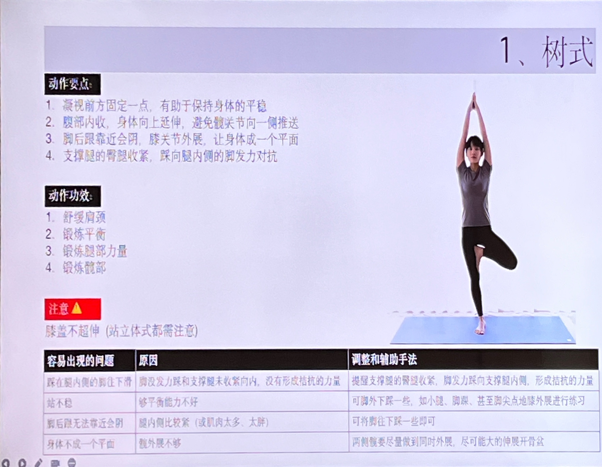
### 动作要点
1. 凝视前方固定一点，有助于保持身体的平稳
2. 腹部内收，身体向上延伸，避免髋关节向一侧推送
3. 脚后跟靠近会阴，膝关节外展，让身体成一个平面
4. 支撑腿的臀腿收紧，踩向腿内侧的脚发力对抗

### 动作功效
1. 舒缓肩颈
2. 锻炼平衡
3. 锻炼腿部力量
4. 锻炼髋部

### 注意
> 膝盖不超伸（站立体式都需注意）

### 辅助手法

|    容易出现的问题    |                       原因                       |                       调整和辅助手法                       |
| :------------------: | :----------------------------------------------: | :--------------------------------------------------------: |
| 踩在腿内侧的脚往下滑 | 脚没发力踩和支撑腿未收紧向内，没有形成拮抗的力量 | 提醒支撑腿的警腿收紧，脚发力踩向支撑腿内侧，形成拮抗的力量 |
|        站不稳        |                  够平衡能力不好                  |  可脚外下踩一些，如小腿、脚踝、甚至脚尖点地膝外展进行练习  |
|  脚后跟无法靠近会阴  |         腿内侧比较紧（或肌肉太多、太胖）         |                    可将脚往下踩一些即可                    |
|   身体不成一个平面   |                    髋外展不够                    |       两侧髋要尽量做到同时外展，尽可能大的伸展开骨盆       |

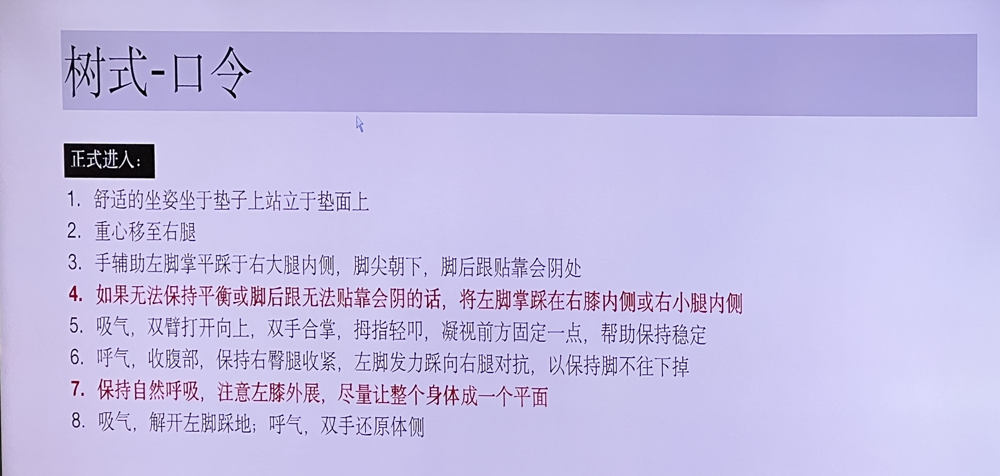
### 动作口令
- 正式进入
1. 舒适的坐姿坐于垫子上站立于垫面上
2. 重心移至右腿
3. 手辅助左脚掌平踩于右大腿内侧，脚尖朝下，脚后跟贴靠会阴处
4. 如果无法保持平衡或脚后跟无法贴靠会阴的话，将左脚掌踩在右膝内侧或右小腿内侧
5. 吸气，双臂打开向上，双手合掌，拇指轻叩，凝视前方固定一点，帮助保持稳定
6. 呼气，收腹部，保持右臀腿收紧，左脚发力踩向右腿对抗，以保持脚不往下掉
7. 保持自然呼吸，注意左膝外展，尽量让整个身体成一个平面
8. 吸气，解开左脚踩地；呼气，双手还原体侧

## 2 风吹树式
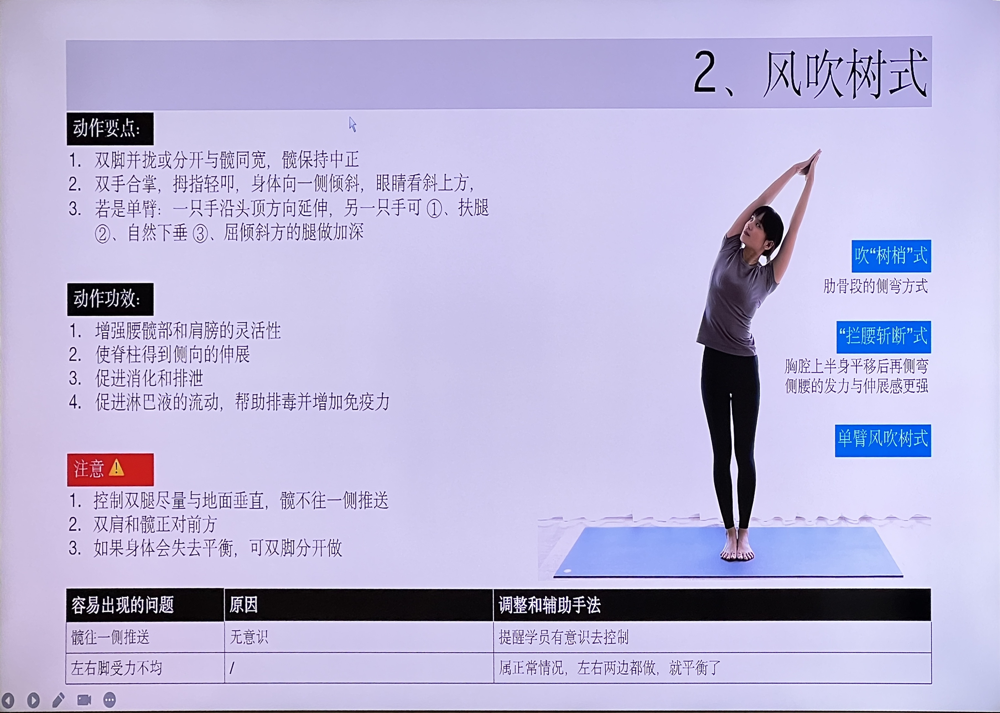

### 动作要点
1. 双脚并拢或分开与髋同宽，髋保持中正
2. 双手合掌，拇指轻叩，身体向一侧倾斜，眼睛看斜上方，
3. 若是单臂：一只手沿头顶方向延伸，另一只手可
​	① 扶腿
​	② 自然下垂
​	③ 屈倾斜方的腿做加深

### 动作功效
1. 增强腰髋部和肩膀的灵活性
2. 使脊柱得到侧向的伸展
3. 促进消化和排泄
4. 促进淋巴液的流动，帮助排毒并增加免疫力

### 注意
> 1. 控制双腿尽量与地面垂直，髋不往一侧推送
> 2. 双肩和髋正对前方
> 3. 如果身体会失去平衡，可双脚分开做

### 辅助手法
| 容易出现的问题 |  原因  |           调整和辅助手法           |
| :------------: | :----: | :--------------------------------: |
|  髋往一侧推送  | 无意识 |        提醒学员有意识去控制        |
| 左右脚受力不均 |   /    | 属正常情况，左右两边都做，就平衡了 |

## 3 鸵鸟式
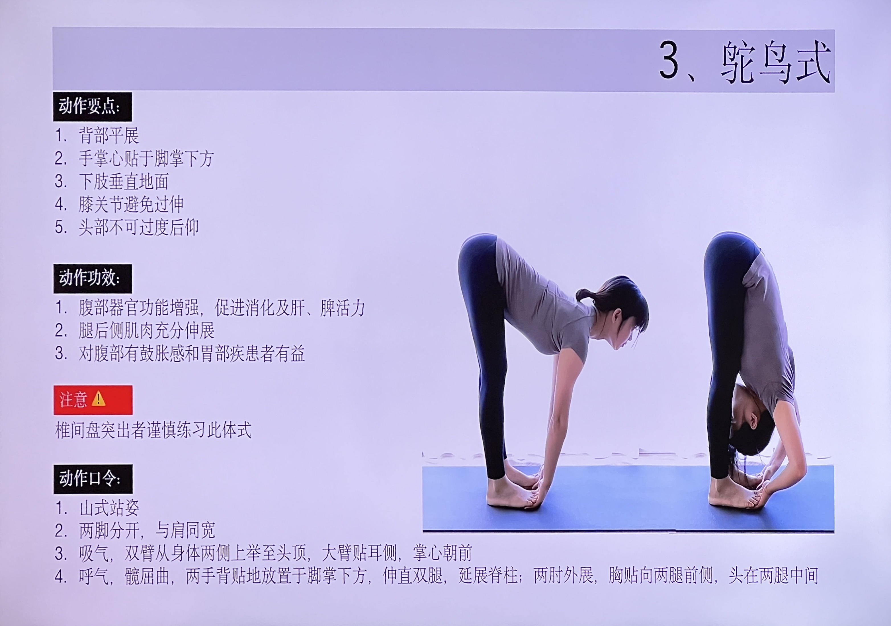
### 动作要点
1. 背部平展
2. 手掌心贴于脚掌下方
3. 下肢垂直地面
4. 膝关节避免过伸
5. 头部不可过度后仰

### 动作功效
1. 腹部器官功能增强，促进消化及肝、脾活力
2. 腿后侧肌肉充分伸展
3. 对腹部有鼓胀感和胃部疾患者有益

### 注意
> 椎间盘突出者谨慎练习此体式

### 动作口令
- 正式进入
1. 山式站姿
2. 两脚分开，与肩同宽
3. 吸气，双臂从身体两侧上举至头顶，大臂贴耳侧，掌心朝前
4. 呼气，髋屈曲，两手背贴地放置于脚掌下方，伸直双腿，延展脊柱；两肘外展，胸贴向两腿前侧，头在两腿中间

## 7 山式坐姿
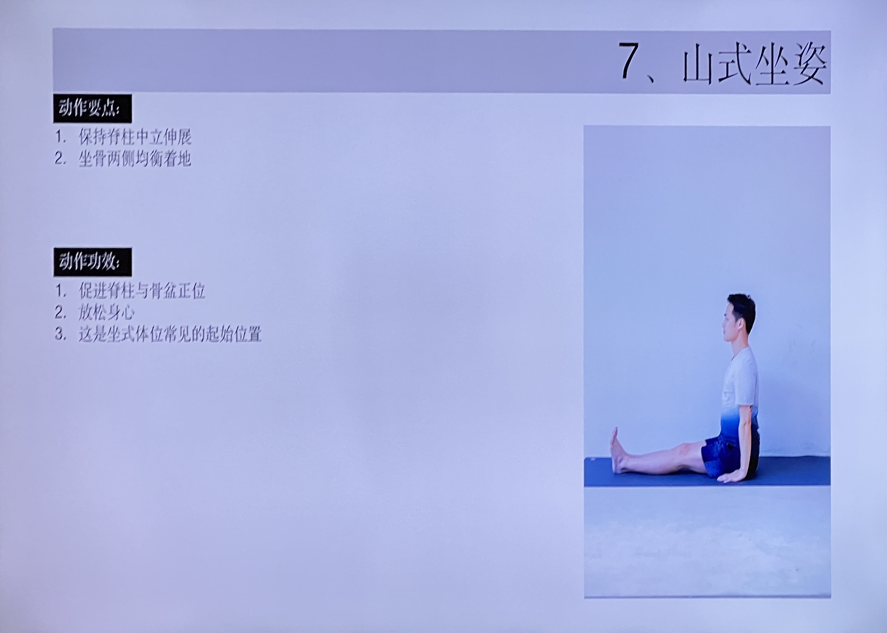
### 动作要点
1. 保持脊柱中立伸展
2. 坐骨两侧均衡着地
### 动作功效：
1. 促进脊柱与骨盆正位
2. 放松身心
3. 这是坐式体位常见的起始位置

## 8 仰卧单腿锁腿
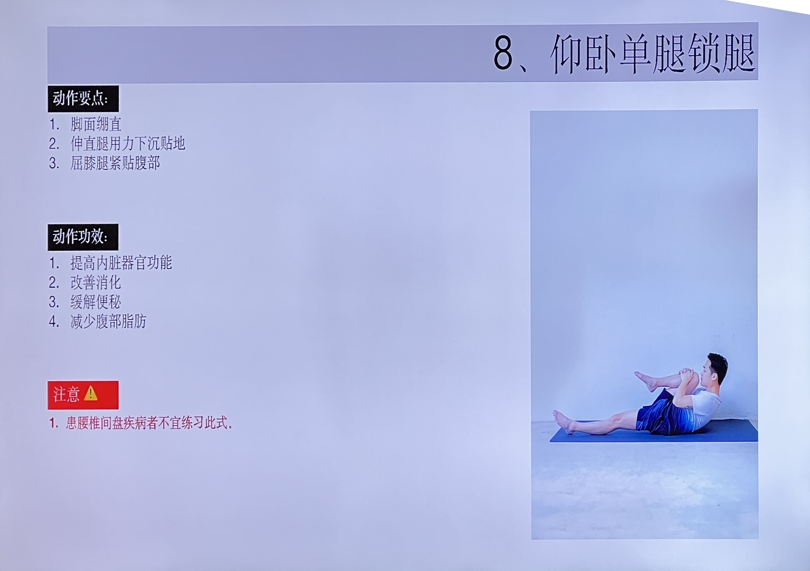
### 动作要点
1. 脚面绷直
2. 伸直腿用力下沉贴地
3. 屈膝腿紧贴腹部
### 动作功效:
1. 提高内脏器官功能
2. 改善消化
3. 缓解便秘
4. 减少腹部脂肪
### 注意
> 患腰椎间盘疾病者不宜练习此式。

## 9 仰卧双腿锁腿
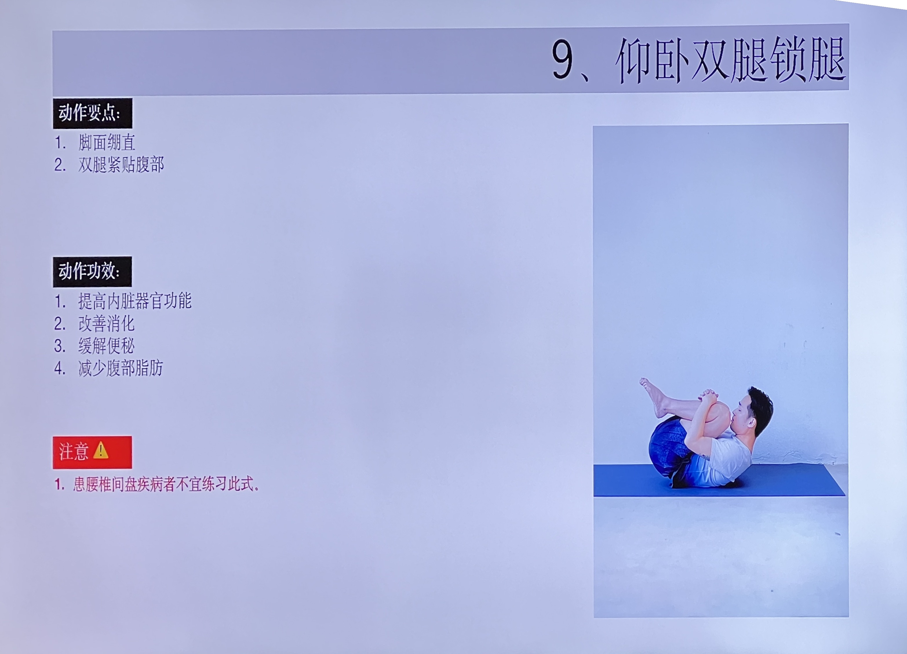
### 动作要点
1. 脚面绷直
2. 双腿紧贴腹部
### 动作功效
1. 提高内脏器官功能
2. 改善消化
3. 缓解便秘
4. 减少腹部脂肪
### 注意
> 患腰椎间盘疾病者不宜练习此式。

## 10 桌子
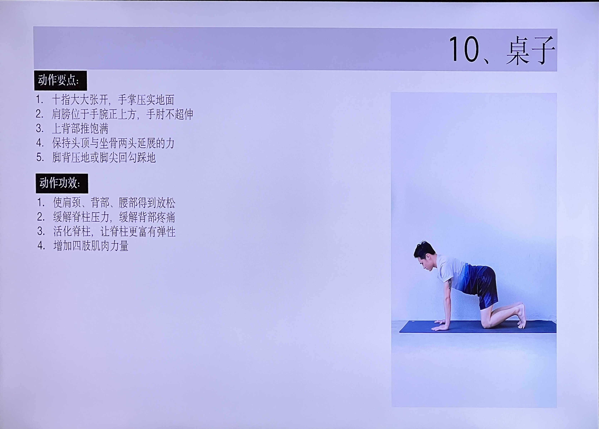
### 动作要点
1. 十指大大张开，手掌压实地面
2. 肩膀位于手腕正上方，手肘不超伸
3. 上背部推饱满
4. 保持头顶与坐骨两头延展的力
5. 脚背压地或脚尖回勾踩地
### 动作功效
1. 使肩颈、背部、腰部得到放松
2. 缓解脊柱压力，缓解背部疼痛
3. 活化脊柱，让脊柱更富有弹性
4. 增加四肢肌肉力量

## 11 简易鸽式
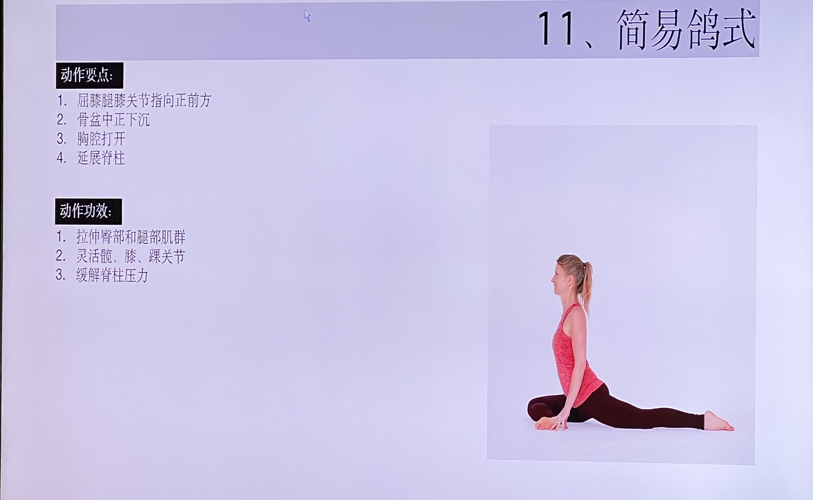
### 动作要点
1. 屈膝腿膝关节指向正前方
2. 骨盆中正下沉
3. 胸腔打开
4. 延展脊柱
### 动作功效
1. 拉伸臀部和腿部肌群
2. 灵活髋、膝、踝关节
3. 缓解脊柱压力

## 14 花环式
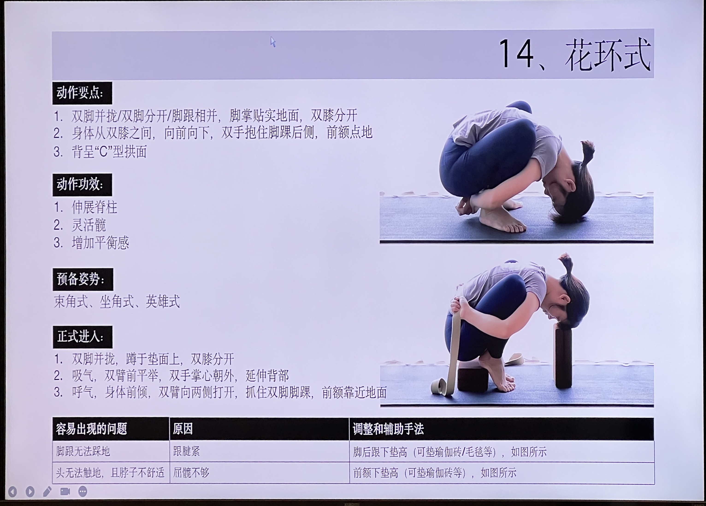
### 动作要点
1. 双脚并拢/双脚分开/脚跟相并，脚掌贴实地面，双膝分开
2. 身体从双膝之间，向前向下，双手抱住脚踝后侧，前额点地
3. 背星“C”型拱面
### 动作功效
1. 伸展脊柱
2. 灵活髋
3. 增加平衡感
### 动作口令
- 预备姿势
> 束角式、坐角式、英雄式
- 正式进人
> 1. 双脚并拢，蹲于垫面上，双膝分开
> 2. 吸气，双臂前平举，双手掌心朝外，延伸背部
> 3. 呼气，身体前倾，双臂向两侧打开，抓住双脚脚踝，前额靠近地面

### 辅助手法
| 容易出现的问题 |  原因  |           调整和辅助手法           |
| :------------: | :----: | :--------------------------------: |
|  脚跟无法踩地  | 跟腱紧 |        脚后跟下垫高（可垫瑜伽砖/毛毯等），如图所示       |
| 头无法触地，且脖子不舒适 |   屈髋不够   | 前额下垫高（可垫瑜伽砖等），如图所示 |

## 17 大拜（主动婴儿）式
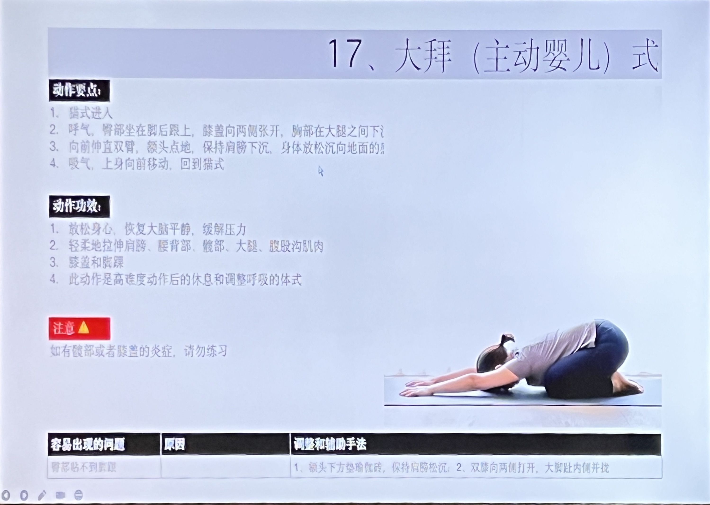
### 动作要点
1. 猫式进入
2. 呼气，腎部坐在脚后跟上，膝盖向两侧张开，胸部在大腿之间下？
3. 向前伸直观臂，额头点地，保持肩下沉，身体放松沉向地面的身
4. 吸气，上身向的移动，回到猫式
### 动作功效
1. 放松身心，侠复大 平静，缓解压力
2. 轻柔地拉伸肩膀、腰背部、镜部、大腿、腹股沟肌肉
3. 膝盖和脚踝
4. 此动作是高难度动作后的休息和调整呼吸的体式
### 注意
> 如有髋部或者膝盖的炎症，请勿练习

### 辅助手法
| 容易出现的问题 |  原因  |           调整和辅助手法           |
| :------------: | :----: | :--------------------------------: |
|  臀部貼不到緊題  | / |        1、额头下力垫瑜伽砖，保特肩膀松沉：2、双膝向两侧打开，大脚趾内侧并找       |

## 18 敬礼式
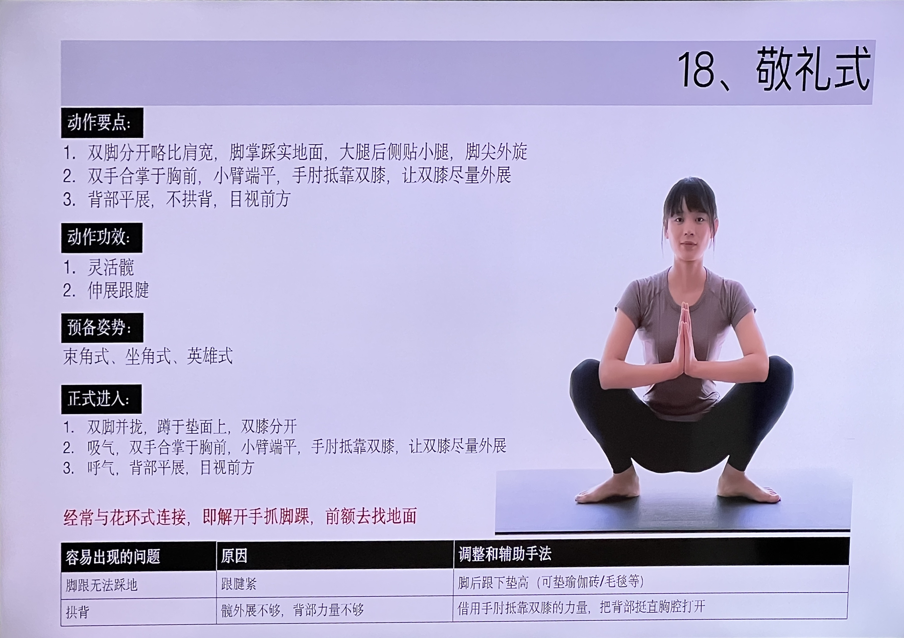

### 动作要点
1. 双脚分开略比肩宽，脚掌踩实地面，大腿后侧贴小腿，脚尖外旋
2. 双手合掌于胸前，小臂端平，手肘抵靠双膝，让双膝尽量外展
3. 背部平展，不拱背，目视前方
### 动作功效
1. 灵活髋
2. 伸展跟腱
### 动作口令
- 预备姿势
> 束角式、坐角式、英雄式
- 正式进人
1. 双脚并拢，蹲于垫面上，双膝分开
2. 吸气，双手合掌于胸前，小臂端平，手肘抵靠双膝，让双膝尽量外展
3. 呼气，背部平展，目视前方
### 注意
> 经常与花环式连接，即解开手抓脚踝，前额去找地面
### 辅助手法
| 容易出现的问题 |  原因  |           调整和辅助手法           |
| :------------: | :----: | :--------------------------------: |
|  脚跟无法踩地  | 跟腱紧 |  脚后跟下垫高（可垫瑜伽砖/毛毯等） |
|  拱背  | 髋外展不够，背部力量不够 |  借用手肘抵靠双膝的力量，把背部挺直胸腔打开） |

## 19 三角伸展式
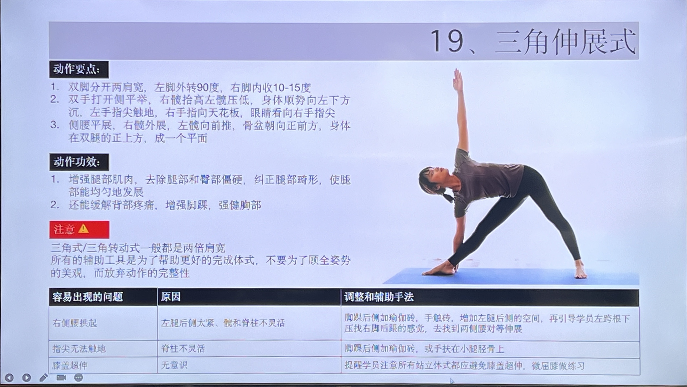
### 动作要点
1. 双脚分开两肩宽，左脚外转90度，右脚内收10-15度
2. 双手打开侧平举，右髋抬高左髋压低，身体顺势向左下方右手指向天花板，
3. 侧腰平展，右磅外展，左髋向前推，骨盆朝向正前方，身体在双腿的正上方，成一个平面
### 动作功效
1. 增强腿部肌肉，去除腿部和臀部僵硬，纠正腿部畸形，使腿部能均匀地发展
2. 还能缓解背部疼痛，增强脚踝，强健胸部
### 注意
> 三角式/三角转动式一般都是两倍肩宽
> 所有的辅助工具是为了帮助更好的完成体式，不要为了顾全姿势的美观，而放弃动作的完整性

### 辅助手法
| 容易出现的问题 |  原因  |           调整和辅助手法           |
| :------------: | :----: | :--------------------------------: |
|  右侧腰拱起  | 左腿后侧太紧、髋和脊柱不灵活 |  脚踝后侧加瑜伽砖，手触砖，增加左腿后侧的空间，再引导学员左跨根下压找右脚后跟的感觉，去找到两侧腰对等伸展  |
|  指尖无法触地  | 脊柱不灵活 |  脚踝后侧加瑜伽砖，或手扶在小腿胫骨上
指尖无法触地  |
|  膝盖超伸  | 无意识 |  提醒学员注意所有站立体式都应避免膝盖超伸，微屈膝做练习  |

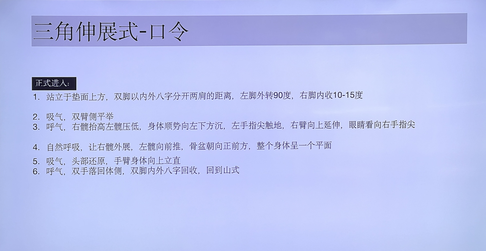
### 动作口令
- 正式进入
1. 站立于垫面上方，双脚以内外八字分开两肩的距离，左脚外转90度，右脚内收10-15度
2. 吸气，双臂侧平举
3. 呼气，右髋抬高左髋压低，身体顺势向左下方沉，左手指尖触地，右臂向上延伸，眼睛看向右手指尖
4. 自然呼吸，让右髋外展，左髋向前推，骨盆朝向正前方，整个身体呈一个平面
5. 吸气，头部还原，手臂身体向上立直
6. 呼气，双手落回体侧，双脚内外八字回收，回到山式

## 20 例角伸展式
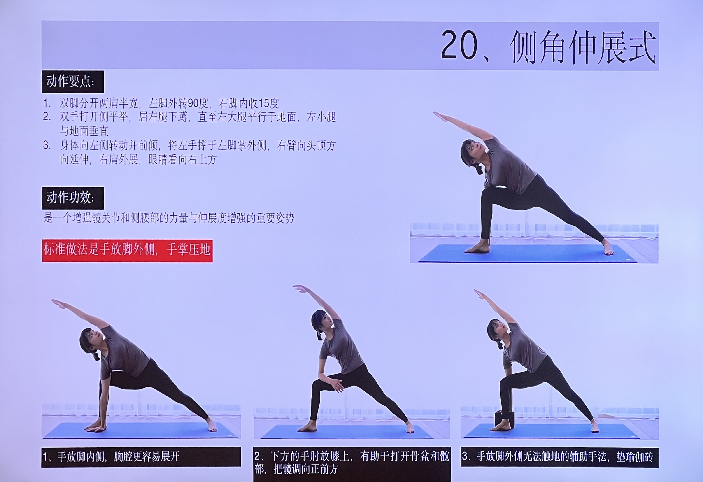

### 动作要点
1. 双脚分开两肩半宽，左脚外转90度，右脚内收15度
2. 双手打开侧平举，屈左腿下蹲，直至左大腿平行于地面，左小腿与地面垂直
3. 身体向左侧转动并前倾，将左手撑于左脚掌外侧，右臂向头顶方向延伸，右肩外展，眼晴看向右上方

### 动作功效
是一个增强髋关节和侧腰部的力量与伸展度增强的重要姿势

### 注意
> 标准做法是手放脚外侧，手掌压地

## 21 站立腰躯扭转式
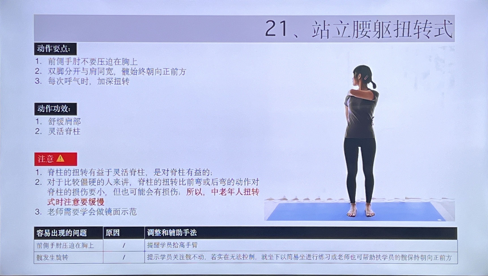

### 动作要点
1. 前侧手肘不要压迫在胸上
2.双脚分开与肩同宽，髋始終朝向正前方
3.每次呼气时，加深扭转
### 动作功效：
1. 舒缓肩部
2. 灵活脊柱
### 注意
1. 脊柱的扭转有益于灵活脊柱，是对脊柱有益的；
2. 对于比较僵硬的人来讲，脊柱的扭转比前弯或后弯的动作对脊柱的损伤要小，但也可能会有损伤；所以，中老年人扭转式时注意要缓慢
3. 老师需要学会做镜面示范
### 辅助手法
| 容易出现的问题 |  原因  |           调整和辅助手法           |
| :------------: | :----: | :--------------------------------: |
|  前侧手肘压迫胸上  | / |        提醒学员拾高手臂       |
|  髋发生旋转  | / |        提示学员关注髋不动，若实在无法控制，就坐下以简易坐进行练习或老师也可帮助扶学员的髋保持向正前方       |

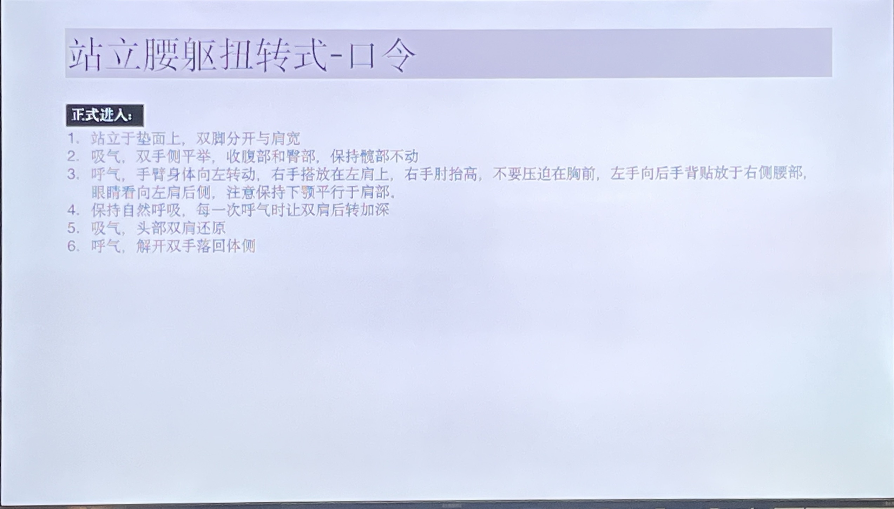
### 动作口令
- 正式进入
1. 站立于垫面上，双脚分开与肩宽
2. 吸气，双手侧平举，收腹部和臀部，保持髋部不动
3. 呼气，手臂身体向左转动，右手搭放在左肩上，右手射抬高，不要压迫在胸前，左手向后手背贴放于右侧腰部，眼睛看向左肩后侧，注意保持下颚平行于肩部。
4. 保持自然呼吸，每一次呼气时让双肩后转加深
5. 吸气，头部双肩还原
6. 呼气，解开双手落回体侧

## 22 坐姿侧展式
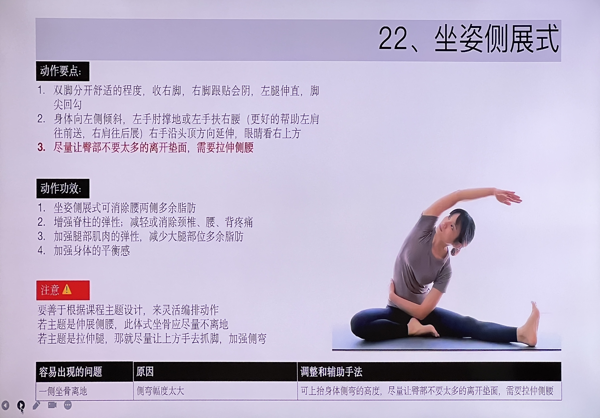
### 动作要点
1. 双脚分开舒适的程度，收右脚，右脚跟贴会阴，左腿伸直，脚尖回勾
2. 身体向左侧倾斜，左手肘撑地或左手扶右腰（更好的帮助左肩往前送，右肩往后展）右手沿头顶方向延伸，眼睛看右上方
3.尽量让臀部不要太多的离开垫面，需要拉伸侧腰
### 动作功效
1.坐姿侧展式可消除腰两侧多余脂防
2. 增强脊柱的弹性；减轻或消除颈椎、腰、背疼痛
3. 加强腿部肌肉的弹性，減少大腿部位多余脂防
4. 加强身体的平衡感
### 注意
>要善于根据课程主题设计，来灵活编排动作
>若主题是伸展侧腰，此体式坐骨应尽量不离地若主题是拉伸腿，那就尽量让上方手去抓脚，加强侧弯

### 辅助手法
| 容易出现的问题 |  原因  |           调整和辅助手法           |
| :------------: | :----: | :--------------------------------: |
|  一侧坐骨离地  | 侧弯幅度太大 |        可上抬身体侧弯的高度，尽量让臀部不要太多的离开垫面，需贾拉件侧腰       |

## 23 摇摆
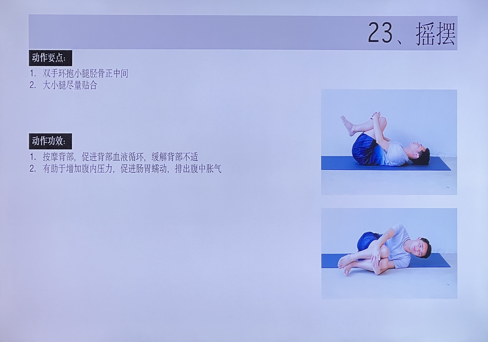

### 动作要点
1. 双手环抱小腿胫骨正中间
2. 大小腿尽量贴合
### 动作功效
1. 按摩背部，促进背部血液循环，缓解背部不适
2. 有助于增加腹内压力，促进肠胃蠕动，排出腹中胀气

## 24 仰卧扭脊式
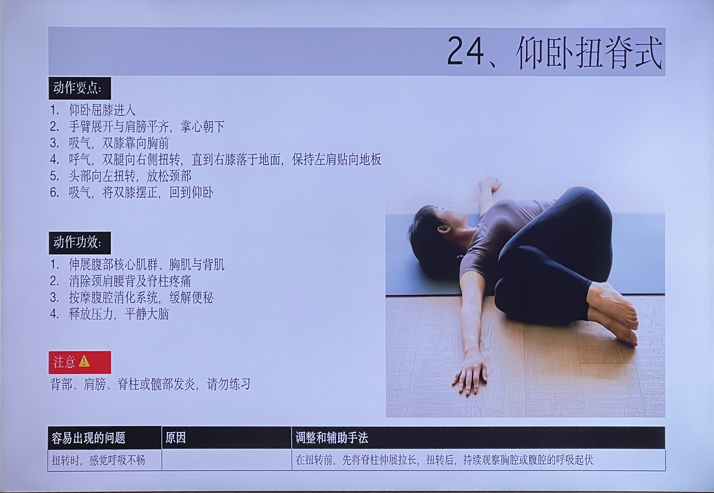
### 动作要点
1. 仰卧屈膝进入
2. 手臂展开与肩膀平齐，掌心朝下
3. 吸气，双膝靠向胸前
4. 呼气，双腿向右侧扭转，直到右膝落于地面，保持左肩贴向地板
5. 头部向左扭转，放松颈部
6. 吸气，将双膝摆正，回到仰卧
### 动作功效
1. 伸展腹部核心肌群、胸肌与背肌
2. 消除颈肩腰背及脊柱疼痛
3. 按摩腹腔消化系统，缓解便秘
4. 释放压力，平静大脑
### 注意
> 背部、肩膀、脊柱或髋部发炎，请勿练习

### 辅助手法
| 容易出现的问题 |  原因  |           调整和辅助手法           |
| :------------: | :----: | :--------------------------------: |
|  扭转时，感觉呼吸不畅  | / |        在扭转前，先将脊柱仲展拉长，扭转后，持续观察胸腔或腹腔的呼吸起伏       |

