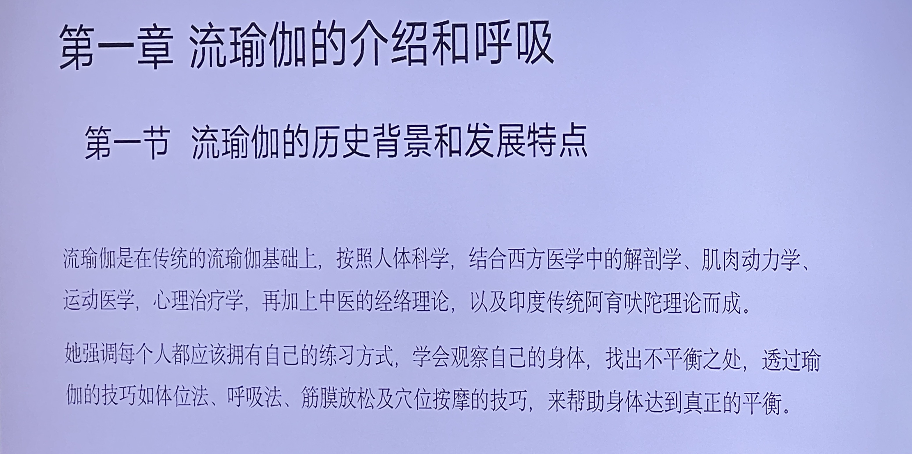
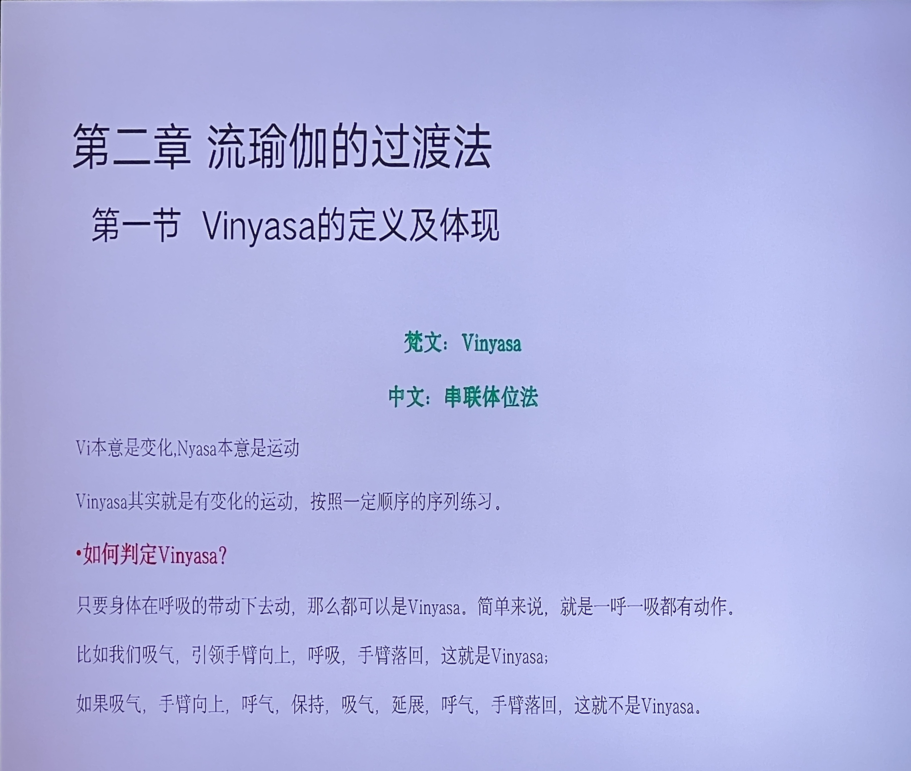

# 流瑜伽课程笔记
[toc]
## 第一章 流瑜伽的介绍和呼吸
### 第一节 流瑜伽的历史背景和发展特点

- 课件原文
> 流瑜伽是在传统的流瑜伽基础上，按照人体科学，结合西方医学中的解剖学、肌肉动力学、运动医学，心理治疗学，再加上中医的经络理论，以及印度传统阿育吠陀理论而成。
她强调每个人都应该拥有自己的练习方式，学会观察自己的身体，找出不平衡之处，透过瑜伽的技巧如体位法、呼吸法、筋膜放松及穴位按摩的技巧，来帮助身体达到真正的平衡。

- newBing梳理
> 流瑜伽是一种结合了东西方医学和哲学的瑜伽流派，它强调个性化的练习方式，以达到身心灵的平衡和健康。流瑜伽的历史背景和发展特点如下：
>- 流瑜伽的起源可以追溯到印度古代的阿斯汤加瑜伽，这是一种以呼吸和动作相配合的快速瑜伽，要求练习者按照一定的顺序完成一系列的体式，每个体式之间用连接动作过渡，形成一个连贯的流动。
>- 流瑜伽在传播到西方后，在欧美诞生并确立了自己的风格，它不再局限于固定的体式顺序，而是根据不同的主题和目标，灵活地设计和组合各种体式，使之更适应不同水平和需求的练习者。
>- 流瑜伽在继承传统瑜伽的精髓的同时，也吸收了西方医学中的解剖学、肌肉动力学、运动医学，心理治疗学等知识，以及中医的经络理论，印度传统阿育吠陀理论等思想，使之更科学、更全面、更深刻地理解人体的结构、功能和心理。
>- 流瑜伽强调每个人都应该拥有自己的练习方式，学会观察自己的身体，找出不平衡之处，透过瑜伽的技巧如体位法、呼吸法、筋膜放松及穴位按摩的技巧，来帮助身体达到真正的平衡。

- 补充
> 无

## 第二章流瑜伽的过渡法
### 第一节 Vinyasa的定义及体现

- 课件原文
> 梵文：Vinyasa
中文:串联体位法
Vi本意是变化，Nyasa本意是运动
Vinyasa其实就是有变化的运动，按照一定顺序的序列练习。
·如何判定Vinyasa?
只要身体在呼吸的带动下去动，那么都可以是Vinyasa。简单来说，就是一呼一吸都有动作比如我们吸气，引领手臂向上，呼吸，手臂落回，这就是Vinyasa；
如果吸气，手臂向上，呼气，保持，吸气，延展，呼气，手臂落回，这就不是Vinyasa.

- newBing梳理
> - Vinyasa是一个梵文词，意思是“以神圣的方式放置”¹，也可以理解为“串联体位法”。
>- Vinyasa是指将不同的体位法按照一定的顺序和呼吸节奏连接在一起，形成一个动态的瑜伽练习。
>- Vinyasa的特点是每个动作都与呼吸相配合，每个体位法之间都有过渡动作，使得整个练习成为一个连贯的流动。
>- Vinyasa的好处是可以增加心肺功能，提高身体的灵活性和力量，促进能量在体内的流通，帮助身心达到平衡和健康。
>- Vinyasa的常见形式有阿斯汤加瑜伽（Ashtanga Yoga）和流瑜伽（Flow Yoga），它们都是基于太阳式（Surya Namaskar）的快速瑜伽，但阿斯汤加瑜伽使用固定的体位法顺序，而流瑜伽则更灵活地设计和组合各种体位法。
>- Vinyasa的核心是呼吸，呼吸决定了动作的节奏和强度，也是连接身体和心灵的桥梁。Vinyasa要求练习者保持平稳，充分和有意识的呼吸，以达到运动冥想（Flow State）的状态。

- 补充
> 无
